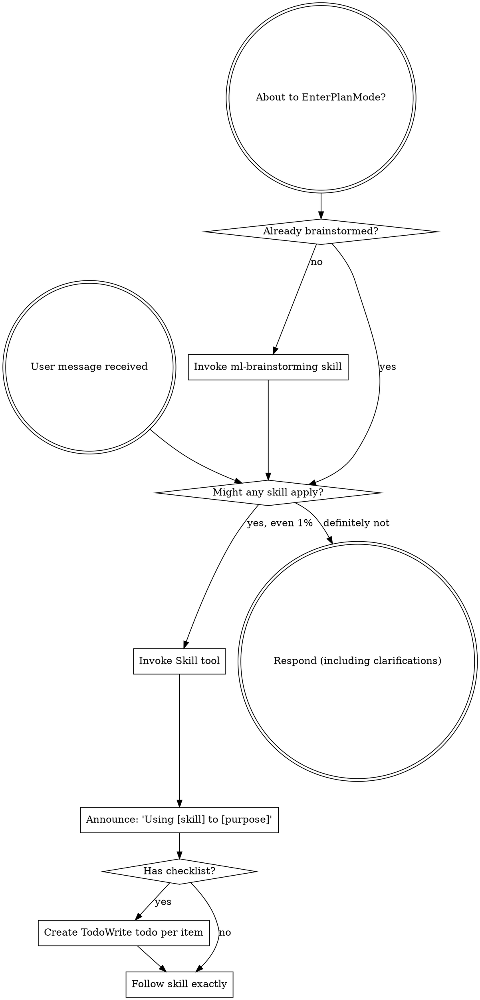
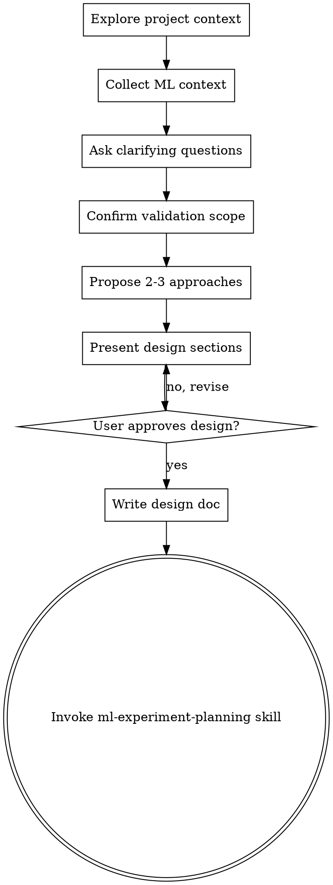

# Superpowers-ML Phase 1 Implementation Plan

> **For Claude:** REQUIRED SUB-SKILL: Use superpowers-ml:executing-plans to implement this plan task-by-task.

**Goal:** Fork superpowers into superpowers-ml with renamed namespace, ML-adapted brainstorming and experiment planning skills, ready for a complete brainstorm -> plan flow.

**Architecture:** Rename all references from "superpowers" to "superpowers-ml" in plugin configs, hooks, and entry skill. Create two new ML-specific skills (ml-brainstorming, ml-experiment-planning) adapted from their original counterparts. Keep all other skills as-is for now.

**Tech Stack:** Markdown skills, JSON configs, bash hooks

---

### Task 1: Rename plugin metadata

**Files:**
- Modify: `.claude-plugin/plugin.json`
- Modify: `.claude-plugin/marketplace.json`
- Modify: `.cursor-plugin/plugin.json`

**Step 1: Update `.claude-plugin/plugin.json`**

Replace entire content with:

```json
{
  "name": "superpowers-ml",
  "description": "ML/RecSys/LLM training workflow for AI agents: Validation Pyramid, experiment planning, process metrics, and proven ML development patterns",
  "version": "0.1.0",
  "author": {
    "name": "superpowers-ml contributors"
  },
  "license": "MIT",
  "keywords": ["ml", "machine-learning", "recsys", "llm", "validation-pyramid", "experiment", "training", "skills", "workflows"],
  "skills": "./skills/",
  "agents": "./agents/",
  "commands": "./commands/",
  "hooks": "./hooks/hooks.json"
}
```

**Step 2: Update `.claude-plugin/marketplace.json`**

Replace entire content with:

```json
{
  "name": "superpowers-ml-dev",
  "description": "Development marketplace for Superpowers-ML skills library",
  "owner": {
    "name": "superpowers-ml contributors"
  },
  "plugins": [
    {
      "name": "superpowers-ml",
      "description": "ML/RecSys/LLM training workflow for AI agents: Validation Pyramid, experiment planning, process metrics",
      "version": "0.1.0",
      "source": "./"
    }
  ]
}
```

**Step 3: Update `.cursor-plugin/plugin.json`**

Replace entire content with:

```json
{
  "name": "superpowers-ml",
  "displayName": "Superpowers-ML",
  "description": "ML/RecSys/LLM training workflow for AI agents: Validation Pyramid, experiment planning, process metrics",
  "version": "0.1.0",
  "author": {
    "name": "superpowers-ml contributors"
  },
  "license": "MIT",
  "keywords": ["ml", "machine-learning", "recsys", "llm", "validation-pyramid", "experiment", "training"],
  "skills": "./skills/",
  "agents": "./agents/",
  "commands": "./commands/",
  "hooks": "./hooks/hooks.json"
}
```

**Step 4: Verify JSON is valid**

Run: `python3 -c "import json; [json.load(open(f)) for f in ['.claude-plugin/plugin.json', '.claude-plugin/marketplace.json', '.cursor-plugin/plugin.json']]; print('All JSON valid')"`
Expected: `All JSON valid`

**Step 5: Commit**

```bash
git add .claude-plugin/plugin.json .claude-plugin/marketplace.json .cursor-plugin/plugin.json
git commit -m "chore: rename plugin metadata from superpowers to superpowers-ml"
```

---

### Task 2: Rename commands

**Files:**
- Rename: `commands/brainstorm.md` -> `commands/ml-brainstorm.md`
- Rename: `commands/write-plan.md` -> `commands/ml-plan.md`
- Rename: `commands/execute-plan.md` -> `commands/ml-execute.md`

**Step 1: Create `commands/ml-brainstorm.md`**

```markdown
---
description: "You MUST use this before any ML work - designing experiments, building models, adding features, or modifying training. Explores requirements, experiment design, and validation scope before implementation."
disable-model-invocation: true
---

Invoke the superpowers-ml:ml-brainstorming skill and follow it exactly as presented to you
```

**Step 2: Create `commands/ml-plan.md`**

```markdown
---
description: Create detailed ML experiment plan with atomic subtasks and validation checkpoints
disable-model-invocation: true
---

Invoke the superpowers-ml:ml-experiment-planning skill and follow it exactly as presented to you
```

**Step 3: Create `commands/ml-execute.md`**

```markdown
---
description: Execute ML experiment plan in batches with validation pyramid checkpoints
disable-model-invocation: true
---

Invoke the superpowers-ml:executing-plans skill and follow it exactly as presented to you
```

**Step 4: Remove old command files**

```bash
rm commands/brainstorm.md commands/write-plan.md commands/execute-plan.md
```

**Step 5: Verify command files exist**

Run: `ls commands/`
Expected: `ml-brainstorm.md  ml-execute.md  ml-plan.md`

**Step 6: Commit**

```bash
git add commands/
git commit -m "chore: rename commands to ml-brainstorm, ml-plan, ml-execute"
```

---

### Task 3: Update hooks to reference superpowers-ml

**Files:**
- Modify: `hooks/session-start`

**Step 1: Update `hooks/session-start`**

In the `session-start` file, make two changes:

1. Change the skill path from `using-superpowers` to `using-superpowers-ml`:

Replace:
```bash
using_superpowers_content=$(cat "${PLUGIN_ROOT}/skills/using-superpowers/SKILL.md" 2>&1 || echo "Error reading using-superpowers skill")
```

With:
```bash
using_superpowers_content=$(cat "${PLUGIN_ROOT}/skills/using-superpowers-ml/SKILL.md" 2>&1 || echo "Error reading using-superpowers-ml skill")
```

2. Change the context message from `superpowers:using-superpowers` to `superpowers-ml:using-superpowers-ml`:

Replace:
```bash
session_context="<EXTREMELY_IMPORTANT>\nYou have superpowers.\n\n**Below is the full content of your 'superpowers:using-superpowers' skill - your introduction to using skills. For all other skills, use the 'Skill' tool:**\n\n${using_superpowers_escaped}\n\n${warning_escaped}\n</EXTREMELY_IMPORTANT>"
```

With:
```bash
session_context="<EXTREMELY_IMPORTANT>\nYou have superpowers-ml.\n\n**Below is the full content of your 'superpowers-ml:using-superpowers-ml' skill - your introduction to ML skills. For all other skills, use the 'Skill' tool:**\n\n${using_superpowers_escaped}\n\n${warning_escaped}\n</EXTREMELY_IMPORTANT>"
```

**Step 2: Verify hook syntax**

Run: `bash -n hooks/session-start && echo "Syntax OK"`
Expected: `Syntax OK`

**Step 3: Commit**

```bash
git add hooks/session-start
git commit -m "chore: update session-start hook to reference superpowers-ml"
```

---

### Task 4: Create using-superpowers-ml skill

**Files:**
- Create: `skills/using-superpowers-ml/SKILL.md`

This is the entry skill that loads on every session start. It replaces `using-superpowers` with ML-specific skill routing.

**Step 1: Create `skills/using-superpowers-ml/SKILL.md`**

```markdown
---
name: using-superpowers-ml
description: Use when starting any conversation - establishes how to find and use ML skills, requiring Skill tool invocation before ANY response including clarifying questions
---

<EXTREMELY-IMPORTANT>
If you think there is even a 1% chance a skill might apply to what you are doing, you ABSOLUTELY MUST invoke the skill.

IF A SKILL APPLIES TO YOUR TASK, YOU DO NOT HAVE A CHOICE. YOU MUST USE IT.

This is not negotiable. This is not optional. You cannot rationalize your way out of this.
</EXTREMELY-IMPORTANT>

## How to Access Skills

**In Claude Code:** Use the `Skill` tool. When you invoke a skill, its content is loaded and presented to you—follow it directly. Never use the Read tool on skill files.

**In other environments:** Check your platform's documentation for how skills are loaded.

# Using Skills

## The Rule

**Invoke relevant or requested skills BEFORE any response or action.** Even a 1% chance a skill might apply means that you should invoke the skill to check. If an invoked skill turns out to be wrong for the situation, you don't need to use it.



## Red Flags

These thoughts mean STOP—you're rationalizing:

| Thought | Reality |
|---------|---------|
| "This is just a simple question" | Questions are tasks. Check for skills. |
| "I need more context first" | Skill check comes BEFORE clarifying questions. |
| "Let me explore the codebase first" | Skills tell you HOW to explore. Check first. |
| "I can check git/files quickly" | Files lack conversation context. Check for skills. |
| "Let me gather information first" | Skills tell you HOW to gather information. |
| "This doesn't need a formal skill" | If a skill exists, use it. |
| "I remember this skill" | Skills evolve. Read current version. |
| "This doesn't count as a task" | Action = task. Check for skills. |
| "The skill is overkill" | Simple things become complex. Use it. |
| "I'll just do this one thing first" | Check BEFORE doing anything. |
| "This feels productive" | Undisciplined action wastes time. Skills prevent this. |
| "I know what that means" | Knowing the concept ≠ using the skill. Invoke it. |
| "ML is different, I can skip the process" | ML needs MORE process, not less. Follow it. |

## Skill Priority

When multiple skills could apply, use this order:

1. **Process skills first** (ml-brainstorming, ml-diagnostics) - these determine HOW to approach the task
2. **Validation skills second** (validation-pyramid, vp-*) - these verify correctness
3. **Implementation skills third** (ml-experiment-planning, ml-subagent-dev) - these guide execution

"Let's train X" -> ml-brainstorming first, then planning skills.
"Training isn't converging" -> ml-diagnostics first, then validation skills.
"MFU is too low" -> ml-diagnostics first, then vp-engineering-efficiency.

## Skill Types

**Rigid** (validation-pyramid, ml-diagnostics): Follow exactly. Don't adapt away discipline.

**Flexible** (framework knowledge): Adapt principles to context.

The skill itself tells you which.

## Core Principle for ML

**In ML, code running without errors does NOT mean it's correct.** "Not working" is reasonable, but the process must be correct. Always validate through the Validation Pyramid before concluding an experiment.

## User Instructions

Instructions say WHAT, not HOW. "Train X" or "Fix convergence" doesn't mean skip workflows.
```

**Step 2: Verify file exists and frontmatter is parseable**

Run: `head -4 skills/using-superpowers-ml/SKILL.md`
Expected:
```
---
name: using-superpowers-ml
description: Use when starting any conversation - establishes how to find and use ML skills, requiring Skill tool invocation before ANY response including clarifying questions
---
```

**Step 3: Commit**

```bash
git add skills/using-superpowers-ml/SKILL.md
git commit -m "feat: add using-superpowers-ml entry skill"
```

---

### Task 5: Create ml-brainstorming skill v1

**Files:**
- Create: `skills/ml-brainstorming/SKILL.md`

This replaces the original brainstorming skill with ML-specific experiment design, context collection, and validation scope confirmation.

**Step 1: Create `skills/ml-brainstorming/SKILL.md`**

```markdown
---
name: ml-brainstorming
description: Use before any ML work - designing experiments, building models, preparing datasets, or optimizing training. Explores experiment design, collects context, and confirms validation scope before implementation.
---

# ML Brainstorming: Ideas Into Experiment Designs

## Overview

Help turn ML ideas into fully formed experiment designs through natural collaborative dialogue.

Start by understanding the current project context, then ask questions one at a time to refine the idea. Once you understand what you're building, present the design and get user approval.

**Core ML principle:** "Not working" is reasonable in ML, but the process must be correct. A bad implementation mistaken for a bad strategy wastes entire research directions. This skill ensures we design experiments that can distinguish the two.

<HARD-GATE>
Do NOT invoke any implementation skill, write any code, scaffold any project, or take any implementation action until you have presented a design and the user has approved it. This applies to EVERY project regardless of perceived simplicity.
</HARD-GATE>

## Anti-Pattern: "This Is Too Simple To Need A Design"

Every project goes through this process. A single ablation, a data pipeline tweak, a hyperparameter sweep — all of them. "Simple" ML tasks are where unexamined assumptions cause the most wasted GPU hours. The design can be short, but you MUST present it and get approval.

## Checklist

You MUST create a task for each of these items and complete them in order:

1. **Explore project context** — check files, docs, recent commits, existing model/training code
2. **Collect ML context** — architecture, task type, scale, existing infra
3. **Ask clarifying questions** — one at a time, understand hypothesis/constraints/success criteria
4. **Confirm validation scope** — which Validation Pyramid layers apply, which to skip
5. **Propose 2-3 approaches** — with trade-offs and your recommendation
6. **Present design** — in sections scaled to their complexity, get user approval after each section
7. **Write design doc** — save to `docs/plans/YYYY-MM-DD-<topic>-design.md` and commit
8. **Transition to implementation** — invoke ml-experiment-planning skill to create implementation plan

## Process Flow



**The terminal state is invoking ml-experiment-planning.** Do NOT invoke any other implementation skill.

## The Process

### Understanding the idea
- Check out the current project state first (files, docs, recent commits, model code)
- Ask questions one at a time to refine the idea
- Prefer multiple choice questions when possible
- Only one question per message
- Focus on understanding: hypothesis, constraints, success criteria

### Collecting ML context
Ask about (one at a time, skip what's already clear):
- **Model architecture** — Transformer / MoE / CNN / RNN / other? Custom layers?
- **Task type** — RecSys / LLM pretraining / LLM fine-tuning / CV / RL / other?
- **Scale** — Single GPU / multi-GPU / multi-node?
- **Existing infra** — What's already built and tested? (data pipeline, training loop, checkpoint, evaluation)
  - Existing infra = don't touch, only advise if problems found
- **Custom components** — Any custom loss, custom layers, custom operators that need unit tests?
- **Model structure decomposition** — For efficiency validation, what's a reasonable segmentation? (e.g., attention block / FFN block / MoE routing)

### Experiment design (when applicable)
For experiment/ablation tasks, clarify:
- **Hypothesis:** Doing X is expected to cause Y
- **Independent variable:** What changes in this experiment
- **Dependent variable:** What metrics to observe
- **Control variable:** What stays the same

### Confirming validation scope
Walk through the Validation Pyramid layers. For each, ask: needed / skip / already covered by existing infra?

**L0: Engineering Efficiency**
- Backend checks (FA, MoE backend, CUDA kernels)
- Bandwidth (NCCL, HBM, PCIE) — multi-node/multi-GPU only
- GPU efficiency (MFU, TCA)
- Infrastructure (checkpoint, W&B, sample consumption speed, memory)
- Data I/O speed

**L1: Process Metrics**
- Universal: gradient health, parameter drift, loss spike detection
- Architecture-specific (auto-recommend based on ML context):
  - Transformer: attention distribution, attention entropy
  - MoE: MoE entropy, load balance
  - Residual networks: residual stream write ratio
  - RecSys: embedding norm stability, negative sampling quality
  - LLM: per-token loss distribution, KV cache growth
- User can add or remove any check

**L2: Overfitting Test**
- Small-scale overfit on 100-1000 samples, fixed seed
- Loss must monotonically decrease to near 0

**L3: End-to-End Pipeline**
- Full flow (data -> training -> inference -> evaluation) on tiny data

**User can skip any layer entirely.** Record decisions in natural language in the design doc.

### Exploring approaches
- Propose 2-3 different approaches with trade-offs
- Present options conversationally with your recommendation and reasoning
- Lead with your recommended option and explain why

### Presenting the design
- Scale each section to its complexity
- Ask after each section whether it looks right so far
- Cover: experiment design, model/data architecture, validation scope, expected outcomes
- Be ready to go back and clarify

## After the Design

**Documentation:**
- Write the validated design to `docs/plans/YYYY-MM-DD-<topic>-design.md`
- Include validation scope decisions in the doc
- Commit the design document to git

**Implementation:**
- Invoke the ml-experiment-planning skill to create a detailed implementation plan
- Do NOT invoke any other skill. ml-experiment-planning is the next step.

## Key Principles

- **One question at a time** — Don't overwhelm with multiple questions
- **Multiple choice preferred** — Easier to answer than open-ended when possible
- **YAGNI ruthlessly** — Remove unnecessary features from all designs
- **Explore alternatives** — Always propose 2-3 approaches before settling
- **Incremental validation** — Present design, get approval before moving on
- **Be flexible** — Go back and clarify when something doesn't make sense
- **Code separation** — Core code (model, training, data) never imports test/validation code. After development, core code is production-deployable as-is.
```

**Step 2: Verify frontmatter**

Run: `head -4 skills/ml-brainstorming/SKILL.md`
Expected:
```
---
name: ml-brainstorming
description: Use before any ML work - designing experiments, building models, preparing datasets, or optimizing training. Explores experiment design, collects context, and confirms validation scope before implementation.
---
```

**Step 3: Commit**

```bash
git add skills/ml-brainstorming/SKILL.md
git commit -m "feat: add ml-brainstorming skill v1"
```

---

### Task 6: Create ml-experiment-planning skill v1

**Files:**
- Create: `skills/ml-experiment-planning/SKILL.md`

This replaces writing-plans with ML-specific experiment decomposition, shared infra annotation, and Validation Pyramid integration.

**Step 1: Create `skills/ml-experiment-planning/SKILL.md`**

```markdown
---
name: ml-experiment-planning
description: Use when you have an ML experiment design or requirements for a multi-step ML task, before touching code
---

# ML Experiment Planning

## Overview

Write comprehensive ML experiment plans assuming the engineer has zero context for the codebase and limited ML debugging experience. Document everything: which files to touch, what to implement, what to test, how to validate, what the expected outcomes are. Break into atomic subtasks. YAGNI. Code separation. Frequent commits.

Assume the implementer is a skilled developer but may not recognize when ML code "runs but is wrong."

**Announce at start:** "I'm using the ml-experiment-planning skill to create the implementation plan."

**Save plans to:** `docs/plans/YYYY-MM-DD-<experiment-name>.md`

## Code Separation Principle

**CRITICAL:** Core code (model, training, data) must never import from test/validation code or toolkit. Validation scripts observe core code externally via hooks/wrappers. After development, core code can be extracted and deployed to production as-is.

The agent determines where to place test and validation code based on the user's existing project structure.

## Plan Document Header

**Every plan MUST start with this header:**

```markdown
# [Experiment Name] Implementation Plan

> **For Claude:** REQUIRED SUB-SKILL: Use superpowers-ml:ml-subagent-dev to implement this plan task-by-task. (If ml-subagent-dev is not yet available, use superpowers-ml:executing-plans.)

**Goal:** [One sentence]

**Hypothesis:** [Doing X is expected to cause Y] (if applicable)

**Validation scope:** [Reference validation scope from brainstorm design doc — which layers enabled, which skipped, key thresholds]

**Architecture:** [2-3 sentences about approach]

---
```

## Plan Structure

Plans have two sections: shared scaffold, then atomic subtasks.

### Shared Scaffold Section

```markdown
## Shared Scaffold

### Existing infra (don't touch, advise if problems found)
- Data pipeline: `path/to/data_loader.py`
- Training loop: `path/to/trainer.py`
- [list all existing infra identified in brainstorm]

### Needs setup
- [Only what's missing, with exact file paths and implementation]
```

### Subtask Structure

Each subtask is an atomic experiment or implementation unit. Each goes through the Validation Pyramid.

````markdown
## Subtask N: [Experiment/Component Name]

**Hypothesis:** [Specific hypothesis for this subtask]
**Implementation:** [What to change, which files]
**Unit Tests:** [Which custom functions need traditional deterministic tests]
**Validation Pyramid:** [Which layers apply + specific metrics + thresholds from brainstorm]
**Expected Conclusion:** [What success means / what failure means]

### Step 1: Write unit tests for custom functions

[Only for deterministic code: custom loss, custom layers, data transforms]

```python
def test_custom_loss_basic():
    pred = torch.tensor([0.5, 0.3, 0.2])
    target = torch.tensor([1.0, 0.0, 0.0])
    loss = custom_loss(pred, target)
    assert loss.shape == ()
    assert not torch.isnan(loss)
```

### Step 2: Run unit tests to verify they fail

Run: `pytest tests/path/test_custom_loss.py -v`
Expected: FAIL (function not defined)

### Step 3: Implement core code

[Exact code, exact file paths. This code goes in the core/src directory — no test/validation imports.]

### Step 4: Run unit tests to verify they pass

Run: `pytest tests/path/test_custom_loss.py -v`
Expected: PASS

### Step 5: Write validation scripts

[Scripts that observe core code externally. These import from toolkit if needed and use hooks/wrappers.]

### Step 6: Run Validation Pyramid

[Exact commands for each enabled layer, with expected output ranges]

Run: `python validation/run_l0_efficiency.py`
Expected: MFU >= 0.40, no backend warnings

Run: `python validation/run_l1_process_metrics.py`
Expected: No NaN/Inf, gradient norm in [1e-4, 1e2], loss decreasing

Run: `python validation/run_l2_overfit.py`
Expected: Loss < 0.01 after 10 epochs on 100 samples

### Step 7: Record conclusion

[What the results mean for the hypothesis]

### Step 8: Commit

```bash
git add [specific files]
git commit -m "experiment: [subtask description]"
```
````

## Bite-Sized Steps Within Subtasks

Each step should be one action:
- "Write the unit test" — step
- "Run it to make sure it fails" — step
- "Write the core implementation" — step
- "Run unit tests to verify" — step
- "Write validation scripts" — step
- "Run Validation Pyramid" — step
- "Record conclusion" — step
- "Commit" — step

## Remember
- Exact file paths always
- Complete code in plan (not "add validation")
- Exact commands with expected output ranges
- Core code never imports from test/validation
- Validation observes externally via hooks/wrappers
- YAGNI, code separation, frequent commits

## Execution Handoff

After saving the plan, offer execution choice:

**"Plan complete and saved to `docs/plans/<filename>.md`. Two execution options:**

**1. Subagent-Driven (this session)** — I dispatch fresh subagent per subtask, review between subtasks, fast iteration

**2. Parallel Session (separate)** — Open new session with executing-plans, batch execution with checkpoints

**Which approach?"**

**If Subagent-Driven chosen:**
- **REQUIRED SUB-SKILL:** Use superpowers-ml:ml-subagent-dev (or superpowers-ml:subagent-driven-development if ml-subagent-dev not yet available)
- Stay in this session

**If Parallel Session chosen:**
- Guide them to open new session
- **REQUIRED SUB-SKILL:** New session uses superpowers-ml:executing-plans
```

**Step 2: Verify frontmatter**

Run: `head -4 skills/ml-experiment-planning/SKILL.md`
Expected:
```
---
name: ml-experiment-planning
description: Use when you have an ML experiment design or requirements for a multi-step ML task, before touching code
---
```

**Step 3: Commit**

```bash
git add skills/ml-experiment-planning/SKILL.md
git commit -m "feat: add ml-experiment-planning skill v1"
```

---

### Task 7: Remove old using-superpowers skill and update README

**Files:**
- Remove: `skills/using-superpowers/SKILL.md`
- Remove: `skills/brainstorming/SKILL.md`
- Modify: `README.md`

**Step 1: Remove superseded skills**

The old `using-superpowers` and `brainstorming` skills are replaced by `using-superpowers-ml` and `ml-brainstorming`. Remove them to avoid confusion.

```bash
rm -rf skills/using-superpowers skills/brainstorming
```

**Step 2: Update README.md header**

Replace the first section of README.md (up to and including the sponsorship section) with:

```markdown
# Superpowers-ML

Superpowers-ML is a complete ML/RecSys/LLM training development workflow for AI coding agents, built on composable "skills" that guide agents through experiment design, implementation, and validation.

## How it works

It starts from the moment you fire up your coding agent. When it sees you're building something ML-related, it doesn't just jump into writing code. Instead, it steps back and asks what you're really trying to do — what's your hypothesis, what architecture are you using, what's your existing infra.

Once it's teased an experiment design out of the conversation, it confirms your **Validation Pyramid** scope — which layers of verification you need (engineering efficiency, process metrics, overfitting tests, end-to-end pipeline) and which you can skip.

After you've signed off on the design, your agent puts together an implementation plan with atomic subtasks. Each subtask goes through the Validation Pyramid to ensure the implementation is correct — because in ML, code running without errors does NOT mean it's correct.

**Core principle:** "Not working" is reasonable in ML, but the process must be correct. If an implementation error causes poor results, you may misjudge your experimental strategy as ineffective, wasting an entire research direction.

Based on [Superpowers](https://github.com/obra/superpowers) by Jesse Vincent.
```

**Step 3: Verify**

Run: `head -5 README.md`
Expected: `# Superpowers-ML`

**Step 4: Commit**

```bash
git add skills/ README.md
git commit -m "feat: replace superpowers entry skills with superpowers-ml, update README"
```

---

### Task 8: Create empty directory structure for future phases

**Files:**
- Create: `skills/validation-pyramid/.gitkeep`
- Create: `skills/vp-engineering-efficiency/.gitkeep`
- Create: `skills/vp-process-metrics/.gitkeep`
- Create: `skills/vp-overfitting-test/.gitkeep`
- Create: `skills/vp-e2e-pipeline/.gitkeep`
- Create: `skills/ml-diagnostics/.gitkeep`
- Create: `skills/ml-subagent-dev/.gitkeep`
- Create: `skills/ml-verification/.gitkeep`
- Create: `skills/frameworks/.gitkeep`
- Create: `toolkit/profiling/.gitkeep`

**Step 1: Create directories**

```bash
mkdir -p skills/validation-pyramid skills/vp-engineering-efficiency skills/vp-process-metrics skills/vp-overfitting-test skills/vp-e2e-pipeline skills/ml-diagnostics skills/ml-subagent-dev skills/ml-verification skills/frameworks toolkit/profiling
touch skills/validation-pyramid/.gitkeep skills/vp-engineering-efficiency/.gitkeep skills/vp-process-metrics/.gitkeep skills/vp-overfitting-test/.gitkeep skills/vp-e2e-pipeline/.gitkeep skills/ml-diagnostics/.gitkeep skills/ml-subagent-dev/.gitkeep skills/ml-verification/.gitkeep skills/frameworks/.gitkeep toolkit/profiling/.gitkeep
```

**Step 2: Verify**

Run: `find skills/validation-pyramid skills/vp-* skills/ml-* skills/frameworks toolkit -name .gitkeep | wc -l`
Expected: `10`

**Step 3: Commit**

```bash
git add skills/validation-pyramid skills/vp-engineering-efficiency skills/vp-process-metrics skills/vp-overfitting-test skills/vp-e2e-pipeline skills/ml-diagnostics skills/ml-subagent-dev skills/ml-verification skills/frameworks toolkit
git commit -m "chore: create directory structure for Phase 2-3 skills and toolkit"
```

---

### Task 9: End-to-end verification

**Step 1: Verify all skill frontmatter is parseable**

Run: `node -e "const {findSkillsInDir} = require('./lib/skills-core.js'); console.log(JSON.stringify(findSkillsInDir('./skills', 'superpowers-ml'), null, 2))"`

Expected: Output should include entries for `using-superpowers-ml`, `ml-brainstorming`, `ml-experiment-planning`, and all existing reused skills (writing-skills, dispatching-parallel-agents, etc.). Should NOT include `using-superpowers` or `brainstorming`.

**Step 2: Verify no broken references to old skill names in remaining files**

Run: `grep -r "superpowers:brainstorming\|superpowers:using-superpowers\b" skills/ commands/ hooks/ --include="*.md" --include="*.sh" -l`

Expected: No output (no files reference old skill names). If files are found, update them to use `superpowers-ml:ml-brainstorming` and `superpowers-ml:using-superpowers-ml`.

**Step 3: Verify command files reference correct skills**

Run: `cat commands/ml-brainstorm.md commands/ml-plan.md commands/ml-execute.md`

Expected: Each file references `superpowers-ml:` prefixed skills.

**Step 4: Verify hook references correct skill path**

Run: `grep "using-superpowers-ml" hooks/session-start`

Expected: Two matches (the cat command and the context message).

**Step 5: Fix any broken references found in Step 2**

If grep found files with old references, update them. Common ones to check:
- `skills/writing-plans/SKILL.md` may reference `superpowers:brainstorming`
- `skills/subagent-driven-development/SKILL.md` may reference `superpowers:test-driven-development`
- Other cross-references between skills

For cross-references to skills we're keeping as-is (like `test-driven-development`), leave the `superpowers:` prefix since those skills haven't been renamed yet — they'll be addressed in later phases.

Only update references to skills we've renamed in this phase:
- `superpowers:brainstorming` -> `superpowers-ml:ml-brainstorming`
- `superpowers:using-superpowers` -> `superpowers-ml:using-superpowers-ml`
- `superpowers:writing-plans` -> `superpowers-ml:ml-experiment-planning`
- `superpowers:executing-plans` -> keep as-is (executing-plans skill not renamed yet)

**Step 6: Commit any fixes**

```bash
git add -A
git commit -m "fix: update cross-references to renamed skills"
```
