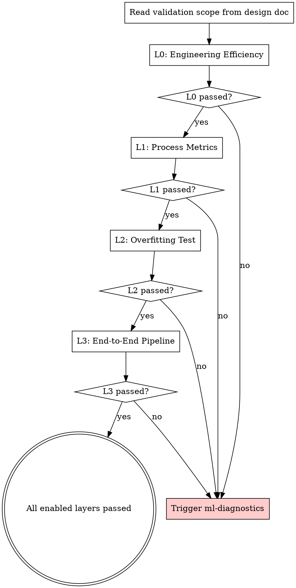

# MLSP Phase 2 Implementation Plan

> **For Claude:** REQUIRED SUB-SKILL: Use mlsp:executing-plans to implement this plan task-by-task.

**Goal:** Deliver the Validation Pyramid core — orchestration skill, L0-L2 layer skills, and profiling toolkit.

**Architecture:** Four skill directories with main SKILL.md + sub-files loaded on demand. Three Python toolkit files with pytest tests. Skills guide the agent; toolkit provides hard-to-write profiling code.

**Tech Stack:** Markdown skills, Python 3.10+, PyTorch, pytest

---

## Part A: Skills (no GPU required)

### Task 1: validation-pyramid skill (orchestration layer)

**Files:**
- Create: `skills/validation-pyramid/SKILL.md`
- Create: `skills/validation-pyramid/decision-tree.md`
- Create: `skills/validation-pyramid/layer-overview.md`

**Step 1: Create `skills/validation-pyramid/SKILL.md`**

```markdown
---
name: validation-pyramid
description: Use when validating ML training code correctness - orchestrates layered checks from engineering efficiency through end-to-end pipeline, replacing traditional TDD for ML workflows
---

# Validation Pyramid

## Overview

~~The Validation Pyramid replaces traditional TDD for ML workflows. Instead of "write test, watch fail, write code, watch pass," it runs layered checks from cheap/fast (L0) to expensive/slow (L3), catching implementation errors before they waste GPU hours.~~

> **Superseded (2026-03-08):** The relationship has been redefined from "replace" to "extend." TDD's RED-GREEN-REFACTOR rhythm now applies to every Pyramid layer. See `2026-03-08-tdd-validation-pyramid-integration-design.md`.

**Core principle:** In ML, code running without errors does NOT mean it's correct. The Validation Pyramid ensures the process is correct, so you can trust that "not working" means the strategy is ineffective — not that the implementation is wrong.

**This is a RIGID skill.** Follow exactly. Don't skip layers. Don't adapt away discipline.

## When to Use

- After implementing any ML code (model, training loop, data pipeline, custom layer)
- During each subtask in an experiment plan
- When ml-diagnostics identifies an issue and you need to re-validate after fixing

## Orchestration Logic



**Rules:**
1. Execute layers in order: L0 -> L1 -> L2 -> L3
2. Skip layers marked as "skip" in design doc
3. Each layer must pass before proceeding to next
4. Failure at any layer -> trigger **mlsp:ml-diagnostics**
5. After diagnostics fix -> re-run from the failed layer, not from L0

## How to Use

1. Read the validation scope from the brainstorm design doc
2. For each enabled layer, invoke the corresponding vp-* skill:
   - L0: **mlsp:vp-engineering-efficiency**
   - L1: **mlsp:vp-process-metrics**
   - L2: **mlsp:vp-overfitting-test**
   - L3: **mlsp:vp-e2e-pipeline**
3. The vp-* skill tells you what to check, what tools to use, how to interpret results
4. Record pass/fail for each layer

## Dynamic Selection Within Layers

Each layer has universal checks and architecture-specific checks. See `decision-tree.md` for which sub-checks to load based on architecture type.

## Hierarchical Decomposition on Failure

When a layer fails:
```
Overall metric not meeting target
    -> Decompose into substructures (defined in brainstorm)
    -> Validate each substructure with mock data
    -> Locate bottleneck substructure
    -> Drill to operator level if needed
```

## Three Granularity Levels

| Granularity | When | Method |
|-------------|------|--------|
| Function/operator | Custom loss, custom layer, single operator | Traditional unit test, deterministic |
| Module/layer | Network substructure efficiency | Mock data, per-segment profiling |
| Experiment | Full L0-L3 pyramid | Training process metrics |

## Quick Reference

See `layer-overview.md` for a compact table of all layers, metrics, and thresholds.

## Red Flags

- Skipping a layer because "it's probably fine"
- Running L2 before L0/L1 pass
- Ignoring a failed layer and proceeding
- Not re-running after a fix
- "I'll validate later" — validate NOW

## Integration

- **mlsp:ml-brainstorming** — Defines validation scope
- **mlsp:ml-diagnostics** — Triggered on failure
- **mlsp:ml-experiment-planning** — Each subtask specifies which layers apply
```

**Step 2: Create `skills/validation-pyramid/decision-tree.md`**

```markdown
# Validation Pyramid Decision Tree

## How to select checks within each layer

Based on the ML context collected during brainstorm, load the appropriate sub-checks.

### L0: Engineering Efficiency

| Context | Load |
|---------|------|
| Always | `backend-checks.md` (core backend verification) |
| Always | `gpu-utilization.md` (MFU/TCA/memory) |
| Multi-GPU or multi-node | `distributed-training.md` (NCCL, communication overhead) |

### L1: Process Metrics

**Universal (always load):**
- `gradient-checks.md` — NaN/Inf, distribution, vanishing/exploding
- `parameter-drift.md` — drift from initialization, loss spike

**Architecture-specific:**

| Architecture | Load |
|-------------|------|
| Transformer | `activation-checks.md` (attention distribution, entropy) |
| Residual networks | `residual-stream.md` (write ratio) |
| MoE | `moe-checks.md` (entropy, load balance) |
| RecSys | `embedding-checks.md` (norm stability, negative sampling) |
| LLM | `token-loss-checks.md` (per-token loss), `kv-cache-checks.md` |

Multiple can apply (e.g., Transformer + MoE + LLM).

### L2: Overfitting Test

Always the same procedure. Task-specific thresholds:

| Task | Success Criteria |
|------|-----------------|
| RecSys | NDCG@10 / Recall@10 near 1.0 |
| LLM | Perplexity < 1.1 or loss < 0.01 |
| General | Training loss monotonically decreasing to near 0 |

### L3: End-to-End Pipeline

Always the same: full flow on tiny data. No sub-selection needed.
```

**Step 3: Create `skills/validation-pyramid/layer-overview.md`**

```markdown
# Validation Pyramid Layer Overview

| Layer | Skill | Cost | Time | What it catches |
|-------|-------|------|------|-----------------|
| **L0** | vp-engineering-efficiency | Very low | Seconds | Wrong backend, bad I/O, low GPU utilization, memory waste |
| **L1** | vp-process-metrics | Low | Seconds-minutes (first N steps) | NaN/Inf, gradient issues, activation collapse, loss spikes, parameter drift |
| **L2** | vp-overfitting-test | Medium | ~10 minutes | Model can't fit small data = implementation bug or architecture issue |
| **L3** | vp-e2e-pipeline | Medium-high | 10-30 minutes | Pipeline integration issues, data-to-evaluation flow broken |

## Pass/Fail Criteria Summary

### L0: Engineering Efficiency
- Backend: Expected backends enabled (FA, MoE kernel, etc.)
- MFU: >= user-defined threshold (typically 0.3-0.6 depending on model)
- TCA: >= user-defined threshold
- Memory: No obvious waste (reserved >> allocated = fragmentation)
- I/O: Data loading not bottlenecking GPU (GPU utilization not dropping during data fetch)
- Bandwidth: NCCL/HBM/PCIE meeting expected throughput

### L1: Process Metrics
- No NaN/Inf in any tensor
- Gradient norms in reasonable range (no vanishing < 1e-7, no exploding > 1e3)
- Loss decreasing in first N steps (for supervised tasks)
- No loss spikes > 10x moving average
- Parameter drift from init in expected range
- Architecture-specific checks pass (attention entropy, MoE balance, etc.)

### L2: Overfitting Test
- Training loss monotonically decreasing to near 0 on 100-1000 samples
- Task-specific metric near perfect (NDCG near 1.0, perplexity near 1.0)
- Completed within expected time

### L3: End-to-End Pipeline
- Full flow completes without error on tiny data
- Inference produces non-degenerate output
- Evaluation metrics computable (not NaN)
```

**Step 4: Remove .gitkeep, verify, commit**

```bash
rm skills/validation-pyramid/.gitkeep
git add skills/validation-pyramid/
git commit -m "feat: add validation-pyramid orchestration skill"
```

---

### Task 2: vp-engineering-efficiency skill (L0)

**Files:**
- Create: `skills/vp-engineering-efficiency/SKILL.md`
- Create: `skills/vp-engineering-efficiency/backend-checks.md`
- Create: `skills/vp-engineering-efficiency/gpu-utilization.md`
- Create: `skills/vp-engineering-efficiency/distributed-training.md`

**Step 1: Create `skills/vp-engineering-efficiency/SKILL.md`**

```markdown
---
name: vp-engineering-efficiency
description: Use when checking L0 engineering efficiency in the Validation Pyramid - backend verification, GPU utilization, memory analysis, I/O speed, and bandwidth checks
---

# L0: Engineering Efficiency

## Overview

The cheapest, fastest layer. Run this FIRST before any training. Catches configuration errors, wrong backends, low GPU utilization, and infrastructure issues in seconds.

**If L0 fails, don't waste time on L1-L3.** Fix infrastructure first.

## What to Check

All checks run on a few forward/backward steps with mock data. No real training needed.

### 1. Backend Verification
See `backend-checks.md` for detailed checks.

**Quick version:**
- Is FlashAttention enabled? (if Transformer)
- Is the correct MoE kernel loaded? (if MoE)
- Are CUDA kernels the expected ones? (not falling back to slow paths)
- Is the correct precision being used? (fp16/bf16/fp32 as intended)

### 2. GPU Utilization
See `gpu-utilization.md` for detailed checks.

**Quick version:**
- MFU (Model FLOPs Utilization): >= user threshold
- TCA (Tensor Core Activity): >= user threshold
- Memory: allocated vs reserved, fragmentation check
- If below target: use `toolkit/profiling/layer_profiler.py` to decompose per-layer

### 3. Data I/O
- Run training for a few steps, check if GPU is idle waiting for data
- Sample consumption speed: tokens/sec or samples/sec meets expectation
- Checkpoint load time: acceptable for the model size

### 4. Infrastructure
- W&B logging connected and receiving data
- Checkpoint save/load works correctly
- mmap data loading working (if applicable)

### 5. Distributed Training (if multi-GPU/multi-node)
See `distributed-training.md` for detailed checks.

**Quick version:**
- NCCL bandwidth meets expected throughput
- HBM bandwidth not bottlenecked
- PCIE bandwidth adequate
- Communication/computation overlap working

## Using Toolkit

When available, use these toolkit tools:
- `toolkit/profiling/mfu_calculator.py` — Calculate MFU/TCA
- `toolkit/profiling/layer_profiler.py` — Per-layer timing decomposition
- `toolkit/profiling/memory_profiler.py` — Memory analysis

If toolkit is not yet available, write equivalent checks following the guidance in this skill.

## Pass Criteria

All enabled checks pass. Any failure -> trigger **mlsp:ml-diagnostics** with the specific failure data.

## Failure Decomposition

If MFU/TCA below target:
1. Use layer_profiler to identify which layers are slow
2. Check if slow layers are using expected kernels
3. Check if data loading is the bottleneck (GPU idle time)
4. For multi-node: check communication overhead
```

**Step 2: Create `skills/vp-engineering-efficiency/backend-checks.md`**

```markdown
# Backend Checks

## FlashAttention

```python
# Check if FlashAttention is being used
import torch
from torch.nn.attention import SDPBackend, sdpa_kernel

# Method 1: Check via torch profiler
with torch.profiler.profile(activities=[torch.profiler.ProfilerActivity.CUDA]) as prof:
    output = model(mock_input)

# Look for flash_attn kernels in profiler output
events = prof.key_averages()
fa_events = [e for e in events if 'flash' in e.key.lower()]
assert len(fa_events) > 0, "FlashAttention not being used — check model config and PyTorch version"

# Method 2: Force and verify
with sdpa_kernel(SDPBackend.FLASH_ATTENTION):
    output = model(mock_input)  # Will error if FA not available
```

## MoE Backend

```python
# Verify MoE routing is using optimized kernel
# This is framework-specific — check your MoE implementation
# Key things to verify:
# 1. Expert parallel is enabled (if multi-GPU)
# 2. Token routing uses optimized scatter/gather
# 3. Load balancing auxiliary loss is active
```

## Precision Check

```python
# Verify model is running in expected precision
for name, param in model.named_parameters():
    assert param.dtype == torch.bfloat16, f"{name} is {param.dtype}, expected bf16"

# Check autocast is working
with torch.autocast('cuda', dtype=torch.bfloat16):
    output = model(mock_input)
    assert output.dtype == torch.bfloat16
```

## CUDA Kernel Selection

```python
# Use profiler to check no slow fallback kernels
with torch.profiler.profile(activities=[torch.profiler.ProfilerActivity.CUDA]) as prof:
    output = model(mock_input)
    loss = criterion(output, mock_target)
    loss.backward()

# Print top CUDA kernels by time
print(prof.key_averages().table(sort_by="cuda_time_total", row_limit=20))
# Look for: unexpected generic kernels instead of optimized ones
```
```

**Step 3: Create `skills/vp-engineering-efficiency/gpu-utilization.md`**

```markdown
# GPU Utilization

## MFU (Model FLOPs Utilization)

MFU = Actual Model FLOPs / Theoretical Peak FLOPs

**Using toolkit (when available):**
```python
from toolkit.profiling.mfu_calculator import calculate_mfu

result = calculate_mfu(model, input_shape=(batch_size, seq_len), step_time_ms=measured_step_time)
print(f"MFU: {result['mfu']:.2%}, TCA: {result['tca']:.2%}")
assert result['mfu'] >= target_mfu, f"MFU {result['mfu']:.2%} below target {target_mfu:.2%}"
```

**Manual calculation:**
```python
import torch
import time

# 1. Count model FLOPs (approximate for Transformer)
def estimate_transformer_flops(num_params, seq_len, batch_size):
    """Approximate: 6 * num_params * seq_len * batch_size per step (fwd + bwd)"""
    return 6 * num_params * seq_len * batch_size

# 2. Measure step time
torch.cuda.synchronize()
start = time.perf_counter()
for _ in range(10):  # warmup + measure
    output = model(mock_input)
    loss = criterion(output, mock_target)
    loss.backward()
    optimizer.step()
    optimizer.zero_grad()
torch.cuda.synchronize()
step_time = (time.perf_counter() - start) / 10

# 3. Get GPU peak FLOPS
# A100: 312 TFLOPS (bf16), H100: 989 TFLOPS (bf16)
gpu_peak_tflops = 312  # Adjust for your GPU

# 4. Calculate
model_flops = estimate_transformer_flops(num_params, seq_len, batch_size)
mfu = model_flops / (gpu_peak_tflops * 1e12 * step_time)
print(f"MFU: {mfu:.2%}")
```

## Memory Analysis

**Using toolkit (when available):**
```python
from toolkit.profiling.memory_profiler import analyze_memory
result = analyze_memory(model, mock_input)
print(result)
```

**Manual check:**
```python
torch.cuda.reset_peak_memory_stats()

output = model(mock_input)
loss = criterion(output, mock_target)
loss.backward()

allocated = torch.cuda.memory_allocated() / 1e9
reserved = torch.cuda.memory_reserved() / 1e9
peak = torch.cuda.max_memory_allocated() / 1e9

print(f"Allocated: {allocated:.2f} GB")
print(f"Reserved:  {reserved:.2f} GB")
print(f"Peak:      {peak:.2f} GB")
print(f"Fragmentation: {(reserved - allocated) / reserved:.1%}")

# Flag if fragmentation > 20%
assert (reserved - allocated) / reserved < 0.2, "High memory fragmentation detected"
```

## Per-Layer Profiling (on failure)

**Using toolkit (when available):**
```python
from toolkit.profiling.layer_profiler import profile_layers
result = profile_layers(model, mock_input)
for layer in result['layers']:
    print(f"{layer['name']}: {layer['time_ms']:.2f}ms ({layer['percentage']:.1f}%)")
```

**Manual:**
```python
with torch.profiler.profile(
    activities=[torch.profiler.ProfilerActivity.CPU, torch.profiler.ProfilerActivity.CUDA],
    record_shapes=True,
    with_stack=True
) as prof:
    output = model(mock_input)
    loss = criterion(output, mock_target)
    loss.backward()

print(prof.key_averages().table(sort_by="cuda_time_total", row_limit=30))
```
```

**Step 4: Create `skills/vp-engineering-efficiency/distributed-training.md`**

```markdown
# Distributed Training Checks

Only load this when training on multi-GPU or multi-node.

## NCCL Bandwidth

```python
import torch
import torch.distributed as dist
import time

def measure_nccl_bandwidth(tensor_size_mb=100):
    """Measure all-reduce bandwidth"""
    tensor = torch.randn(tensor_size_mb * 1024 * 1024 // 4, device='cuda')

    # Warmup
    for _ in range(5):
        dist.all_reduce(tensor)
    torch.cuda.synchronize()

    # Measure
    start = time.perf_counter()
    n_iters = 20
    for _ in range(n_iters):
        dist.all_reduce(tensor)
    torch.cuda.synchronize()
    elapsed = time.perf_counter() - start

    # Bus bandwidth = data_size * 2 * (n-1) / n / time (for ring all-reduce)
    world_size = dist.get_world_size()
    data_bytes = tensor.nelement() * tensor.element_size()
    bus_bw = data_bytes * 2 * (world_size - 1) / world_size / (elapsed / n_iters) / 1e9
    print(f"NCCL bus bandwidth: {bus_bw:.1f} GB/s")
    return bus_bw

# Expected: ~300 GB/s for NVLink, ~12 GB/s for PCIe 4.0 x16
```

## Communication/Computation Overlap

```python
# Check if backward pass overlaps with gradient all-reduce
# Use torch profiler and look for overlap between NCCL kernels and compute kernels
with torch.profiler.profile(
    activities=[torch.profiler.ProfilerActivity.CPU, torch.profiler.ProfilerActivity.CUDA]
) as prof:
    output = model(mock_input)
    loss = criterion(output, mock_target)
    loss.backward()
    optimizer.step()

# Export to Chrome trace for visual inspection
prof.export_chrome_trace("trace.json")
# Look for: NCCL all-reduce running concurrently with backward compute
```

## Gradient Synchronization

```python
# Verify gradients are correctly synchronized across ranks
for name, param in model.named_parameters():
    if param.grad is not None:
        grad_sum = param.grad.clone()
        dist.all_reduce(grad_sum)
        expected = param.grad * dist.get_world_size()
        assert torch.allclose(grad_sum, expected, rtol=1e-3), \
            f"Gradient sync issue in {name}"
```
```

**Step 5: Remove .gitkeep, verify, commit**

```bash
rm skills/vp-engineering-efficiency/.gitkeep
head -4 skills/vp-engineering-efficiency/SKILL.md
git add skills/vp-engineering-efficiency/
git commit -m "feat: add vp-engineering-efficiency skill (L0)"
```

---

### Task 3: vp-process-metrics skill (L1)

**Files:**
- Create: `skills/vp-process-metrics/SKILL.md`
- Create: `skills/vp-process-metrics/gradient-checks.md`
- Create: `skills/vp-process-metrics/activation-checks.md`
- Create: `skills/vp-process-metrics/parameter-drift.md`
- Create: `skills/vp-process-metrics/residual-stream.md`
- Create: `skills/vp-process-metrics/moe-checks.md`
- Create: `skills/vp-process-metrics/embedding-checks.md`
- Create: `skills/vp-process-metrics/token-loss-checks.md`
- Create: `skills/vp-process-metrics/kv-cache-checks.md`

**Step 1: Create `skills/vp-process-metrics/SKILL.md`**

```markdown
---
name: vp-process-metrics
description: Use when checking L1 process metrics in the Validation Pyramid - gradient health, activation distributions, parameter drift, loss spikes, and architecture-specific training signals
---

# L1: Process Metrics

## Overview

Check training process health after a few steps of actual training. This catches numerical issues, gradient problems, and architecture-specific anomalies that L0 can't detect.

**Run after L0 passes.** Typically check after the first 10-100 training steps.

## Universal Checks (always run)

### Gradient Health
See `gradient-checks.md` for detailed implementation.

- No NaN/Inf in any gradient
- Gradient norms in reasonable range (not vanishing < 1e-7, not exploding > 1e3)
- Gradient distribution not degenerate (not all zeros, not all same value)

### Parameter Drift
See `parameter-drift.md` for detailed implementation.

- Parameters changing from initialization (training is happening)
- Drift rate in expected range (not too fast = exploding, not too slow = vanishing)
- Loss spike detection (> 10x moving average)

## Architecture-Specific Checks (load based on context)

Load sub-files based on the decision tree in `validation-pyramid/decision-tree.md`:

| Architecture | Sub-file | What it checks |
|-------------|----------|----------------|
| Transformer | `activation-checks.md` | Attention distribution, attention entropy |
| Residual networks | `residual-stream.md` | Residual stream write ratio |
| MoE | `moe-checks.md` | Expert entropy, load balance |
| RecSys | `embedding-checks.md` | Embedding norm stability, negative sampling quality |
| LLM | `token-loss-checks.md` | Per-token loss distribution |
| LLM | `kv-cache-checks.md` | KV cache memory growth |

## How to Run

1. Train for 10-100 steps on real or representative data
2. During training, collect metrics using hooks (gradient, activation monitors)
3. After N steps, analyze collected metrics against thresholds
4. Report pass/fail per check

## Pass Criteria

All enabled universal + architecture-specific checks pass. Any failure -> trigger **mlsp:ml-diagnostics**.

## Writing Monitors

Agent writes monitoring code per-project. General pattern:

```python
# Register hooks before training
hooks = []
grad_stats = {}

def grad_hook(name):
    def hook(grad):
        grad_stats[name] = {
            'mean': grad.mean().item(),
            'std': grad.std().item(),
            'max': grad.abs().max().item(),
            'has_nan': torch.isnan(grad).any().item(),
            'has_inf': torch.isinf(grad).any().item(),
        }
    return hook

for name, param in model.named_parameters():
    if param.requires_grad:
        hooks.append(param.register_hook(grad_hook(name)))

# Train N steps...

# Remove hooks after collection
for h in hooks:
    h.remove()

# Analyze
for name, stats in grad_stats.items():
    assert not stats['has_nan'], f"NaN gradient in {name}"
    assert not stats['has_inf'], f"Inf gradient in {name}"
    assert stats['max'] < 1e3, f"Exploding gradient in {name}: max={stats['max']}"
    assert stats['max'] > 1e-7, f"Vanishing gradient in {name}: max={stats['max']}"
```
```

**Step 2: Create all sub-files**

`gradient-checks.md`:
```markdown
# Gradient Checks

## NaN/Inf Detection

```python
# Check every step during initial validation
for name, param in model.named_parameters():
    if param.grad is not None:
        assert not torch.isnan(param.grad).any(), f"NaN gradient in {name}"
        assert not torch.isinf(param.grad).any(), f"Inf gradient in {name}"
```

## Gradient Norm Monitoring

```python
# Track gradient norms per layer over steps
def compute_grad_norms(model):
    norms = {}
    for name, param in model.named_parameters():
        if param.grad is not None:
            norms[name] = param.grad.norm().item()
    return norms

# After each step:
step_norms = compute_grad_norms(model)
total_norm = torch.nn.utils.clip_grad_norm_(model.parameters(), max_norm=float('inf'))

# Thresholds (adjust based on model):
# - Total norm < 1e-7: likely vanishing
# - Total norm > 1e3: likely exploding
# - Sudden 10x jump: gradient spike
```

## Gradient Distribution

```python
# Check gradient histogram for degenerate distributions
for name, param in model.named_parameters():
    if param.grad is not None:
        g = param.grad.flatten()
        # Not all zeros
        assert g.abs().max() > 0, f"All-zero gradient in {name}"
        # Not all same value
        assert g.std() > 0, f"Constant gradient in {name}"
        # Reasonable kurtosis (not too peaked)
```
```

`activation-checks.md`:
```markdown
# Activation Checks (Transformer)

## Attention Distribution

```python
# Hook into attention layers to capture attention weights
attention_weights = {}

def attention_hook(name):
    def hook(module, input, output):
        # output format depends on implementation
        # Common: (attn_output, attn_weights)
        if isinstance(output, tuple) and len(output) > 1:
            attention_weights[name] = output[1].detach()
    return hook

# Register hooks on attention layers
for name, module in model.named_modules():
    if 'attention' in name.lower() or 'attn' in name.lower():
        module.register_forward_hook(attention_hook(name))
```

## Attention Entropy

```python
# High entropy = attention is spread out (usually good early in training)
# Very low entropy = attention collapsed to few positions (potential problem)
import torch.nn.functional as F

for name, weights in attention_weights.items():
    # weights shape: (batch, heads, seq, seq)
    probs = weights.float()
    entropy = -(probs * (probs + 1e-10).log()).sum(dim=-1).mean()
    max_entropy = torch.log(torch.tensor(probs.shape[-1], dtype=torch.float))
    normalized_entropy = entropy / max_entropy

    print(f"{name}: entropy={normalized_entropy:.3f}")
    # Flag if normalized entropy < 0.1 (attention collapsed)
    assert normalized_entropy > 0.1, f"Attention collapsed in {name}"
```
```

`parameter-drift.md`:
```markdown
# Parameter Drift

## Track Drift from Initialization

```python
import copy

# Before training: snapshot initial parameters
init_params = {name: param.data.clone() for name, param in model.named_parameters()}

# After N steps: compute drift
def compute_drift(model, init_params):
    drift = {}
    for name, param in model.named_parameters():
        if name in init_params:
            diff = (param.data - init_params[name]).norm()
            init_norm = init_params[name].norm()
            drift[name] = {
                'absolute': diff.item(),
                'relative': (diff / (init_norm + 1e-10)).item()
            }
    return drift

drift = compute_drift(model, init_params)
for name, d in drift.items():
    # Parameters should be changing (training is happening)
    assert d['absolute'] > 0, f"{name} hasn't changed from init — not being trained?"
    # But not too fast (explosion)
    assert d['relative'] < 10.0, f"{name} drifted {d['relative']:.1f}x from init — too fast"
```

## Loss Spike Detection

```python
# Track loss over steps
loss_history = []

# After each step:
loss_history.append(loss.item())

# Check for spikes
if len(loss_history) > 10:
    window = loss_history[-10:]
    moving_avg = sum(window) / len(window)
    current = loss_history[-1]

    if current > moving_avg * 10:
        print(f"WARNING: Loss spike detected! Current={current:.4f}, Moving avg={moving_avg:.4f}")
```

## Loss Trend (Supervised Tasks)

```python
# For supervised learning, loss should decrease in early steps
if len(loss_history) >= 20:
    first_half = sum(loss_history[:10]) / 10
    second_half = sum(loss_history[10:20]) / 10
    assert second_half < first_half, \
        f"Loss not decreasing: first 10 steps avg={first_half:.4f}, next 10 avg={second_half:.4f}"
```
```

`residual-stream.md`:
```markdown
# Residual Stream Checks

## Write Ratio

The residual stream write ratio measures how much each layer modifies the residual stream relative to the stream's magnitude.

```python
residual_norms = {}

def residual_hook(name):
    def hook(module, input, output):
        if isinstance(input, tuple):
            residual_in = input[0]
        else:
            residual_in = input

        residual_out = output if not isinstance(output, tuple) else output[0]

        # Write = how much this layer changed the residual
        write = (residual_out - residual_in).norm()
        stream_norm = residual_in.norm()
        write_ratio = (write / (stream_norm + 1e-10)).item()

        residual_norms[name] = write_ratio
    return hook

# Register on residual-producing layers (e.g., transformer blocks)
for name, module in model.named_modules():
    if 'block' in name.lower() or 'layer' in name.lower():
        module.register_forward_hook(residual_hook(name))

# After forward pass:
for name, ratio in residual_norms.items():
    print(f"{name}: write_ratio={ratio:.4f}")
    # Flag if write ratio > 1.0 (layer output larger than residual = potential instability)
    # Flag if write ratio < 1e-4 (layer barely contributing)
```
```

`moe-checks.md`:
```markdown
# MoE Checks

## Expert Load Balance

```python
# Track token routing to each expert
expert_counts = {}

def router_hook(name):
    def hook(module, input, output):
        # output typically includes routing decisions
        # Adjust based on your MoE implementation
        if hasattr(output, 'router_logits'):
            routing = output.router_logits.argmax(dim=-1)
            counts = torch.bincount(routing.flatten(), minlength=module.num_experts)
            expert_counts[name] = counts.float()
    return hook

# After collecting:
for name, counts in expert_counts.items():
    total = counts.sum()
    probs = counts / total
    # Entropy of routing distribution
    entropy = -(probs * (probs + 1e-10).log()).sum()
    max_entropy = torch.log(torch.tensor(len(probs), dtype=torch.float))
    balance = (entropy / max_entropy).item()

    print(f"{name}: balance={balance:.3f} (1.0 = perfect)")
    # Flag if balance < 0.5 (experts very unevenly loaded)
    assert balance > 0.5, f"Poor expert balance in {name}: {balance:.3f}"
```

## Auxiliary Loss

```python
# Verify auxiliary balancing loss is active and reasonable
# This is typically a load-balancing loss added to the main loss
# Check it's not zero (disabled) and not dominating (too large)
if hasattr(model, 'aux_loss'):
    aux = model.aux_loss.item()
    main = loss.item()
    ratio = aux / (main + 1e-10)
    print(f"Aux loss ratio: {ratio:.3f}")
    assert ratio < 0.1, f"Aux loss too large relative to main loss: {ratio:.3f}"
    assert aux > 0, "Aux loss is zero — load balancing may be disabled"
```
```

`embedding-checks.md`:
```markdown
# Embedding Checks (RecSys)

## Embedding Norm Stability

```python
# Track L2 norm of user/item embeddings over training steps
def check_embedding_norms(model, step):
    for name, param in model.named_parameters():
        if 'embed' in name.lower():
            norms = param.data.norm(dim=-1)
            print(f"Step {step} | {name}: mean_norm={norms.mean():.3f}, max={norms.max():.3f}, min={norms.min():.3f}")

            # Norms should be stable, not exploding
            assert norms.max() < 100, f"Embedding norm exploding in {name}: max={norms.max():.1f}"
            # Norms shouldn't collapse to zero
            assert norms.min() > 1e-4, f"Embedding norm collapsed in {name}: min={norms.min():.6f}"
```

## Negative Sampling Quality

```python
# Verify negative samples are actually harder than random
# positive score should be > negative score on average
def check_negative_sampling(model, pos_pairs, neg_pairs):
    with torch.no_grad():
        pos_scores = model.score(pos_pairs)
        neg_scores = model.score(neg_pairs)

    print(f"Pos score mean: {pos_scores.mean():.4f}")
    print(f"Neg score mean: {neg_scores.mean():.4f}")

    assert pos_scores.mean() > neg_scores.mean(), \
        "Negative samples scoring higher than positives — check sampling logic"
```

## Popularity Bias

```python
# Check that popular item embeddings aren't collapsing to be too similar
def check_popularity_bias(item_embeddings, popular_indices, threshold=0.95):
    popular_embeds = item_embeddings[popular_indices]
    # Cosine similarity between popular items
    normed = F.normalize(popular_embeds, dim=-1)
    sim_matrix = normed @ normed.T
    # Exclude diagonal
    mask = ~torch.eye(len(popular_indices), dtype=torch.bool, device=sim_matrix.device)
    avg_sim = sim_matrix[mask].mean().item()

    print(f"Avg cosine similarity between popular items: {avg_sim:.3f}")
    assert avg_sim < threshold, f"Popular items too similar ({avg_sim:.3f}) — embedding collapse"
```
```

`token-loss-checks.md`:
```markdown
# Token Loss Checks (LLM)

## Per-Token Loss Distribution

```python
# Check that loss is not concentrated on few tokens
def check_token_loss_distribution(model, input_ids, labels):
    with torch.no_grad():
        outputs = model(input_ids, labels=labels)
        # Get per-token loss
        logits = outputs.logits
        shift_logits = logits[..., :-1, :].contiguous()
        shift_labels = labels[..., 1:].contiguous()

        loss_fct = torch.nn.CrossEntropyLoss(reduction='none')
        per_token_loss = loss_fct(
            shift_logits.view(-1, shift_logits.size(-1)),
            shift_labels.view(-1)
        )

    # Reshape and analyze
    valid = shift_labels.view(-1) != -100  # ignore padding
    valid_losses = per_token_loss[valid]

    print(f"Per-token loss: mean={valid_losses.mean():.3f}, std={valid_losses.std():.3f}")
    print(f"Max token loss: {valid_losses.max():.3f}")
    print(f"Fraction > 2*mean: {(valid_losses > 2 * valid_losses.mean()).float().mean():.3f}")

    # Flag if too concentrated (most tokens trivially predicted, few very hard)
    cv = valid_losses.std() / (valid_losses.mean() + 1e-10)
    assert cv < 5.0, f"Token loss too concentrated (CV={cv:.1f}) — model may be ignoring hard tokens"
```

## Generation Diversity

```python
# Check that generated text is not degenerate (all same token, repetitive)
def check_generation_diversity(model, tokenizer, prompt, num_samples=5, max_length=50):
    generations = []
    for _ in range(num_samples):
        input_ids = tokenizer.encode(prompt, return_tensors='pt').cuda()
        output = model.generate(input_ids, max_length=max_length, do_sample=True, top_k=50)
        text = tokenizer.decode(output[0], skip_special_tokens=True)
        generations.append(text)

    # Check uniqueness
    unique = len(set(generations))
    print(f"Unique generations: {unique}/{num_samples}")
    assert unique > 1, "All generations identical — sampling may be broken"

    # Check for degenerate repetition within each generation
    for gen in generations:
        tokens = gen.split()
        if len(tokens) > 5:
            unique_tokens = len(set(tokens))
            ratio = unique_tokens / len(tokens)
            assert ratio > 0.2, f"Very repetitive generation (unique ratio={ratio:.2f}): {gen[:100]}"
```
```

`kv-cache-checks.md`:
```markdown
# KV Cache Checks (LLM)

## Memory Growth

```python
# Verify KV cache memory grows linearly with sequence length
def check_kv_cache_growth(model, tokenizer, prompt="Hello", max_steps=10):
    input_ids = tokenizer.encode(prompt, return_tensors='pt').cuda()
    memory_per_step = []

    past_key_values = None
    for step in range(max_steps):
        torch.cuda.reset_peak_memory_stats()
        with torch.no_grad():
            outputs = model(
                input_ids if step == 0 else next_token,
                past_key_values=past_key_values,
                use_cache=True
            )
        past_key_values = outputs.past_key_values
        next_token = outputs.logits[:, -1:].argmax(dim=-1)
        memory_per_step.append(torch.cuda.max_memory_allocated() / 1e6)

    # Check growth is roughly linear
    if len(memory_per_step) >= 3:
        diffs = [memory_per_step[i+1] - memory_per_step[i] for i in range(1, len(memory_per_step)-1)]
        avg_diff = sum(diffs) / len(diffs)
        max_diff = max(diffs)

        print(f"KV cache growth per step: avg={avg_diff:.1f}MB, max={max_diff:.1f}MB")
        # Flag if any step grows much more than average (memory leak or unexpected allocation)
        assert max_diff < avg_diff * 3, f"Non-linear KV cache growth detected: max={max_diff:.1f}MB vs avg={avg_diff:.1f}MB"
```
```

**Step 3: Remove .gitkeep, verify, commit**

```bash
rm skills/vp-process-metrics/.gitkeep
ls skills/vp-process-metrics/
git add skills/vp-process-metrics/
git commit -m "feat: add vp-process-metrics skill (L1) with all sub-files"
```

---

### Task 4: vp-overfitting-test skill (L2)

**Files:**
- Create: `skills/vp-overfitting-test/SKILL.md`

**Step 1: Create `skills/vp-overfitting-test/SKILL.md`**

```markdown
---
name: vp-overfitting-test
description: Use when running L2 overfitting test in the Validation Pyramid - validates model can memorize small dataset, proving implementation correctness before expensive full training
---

# L2: Overfitting Test

## Overview

The fastest way to verify a model implementation is correct: if it can't memorize 100-1000 samples, something is wrong with the implementation. This test takes ~10 minutes and catches bugs that would otherwise waste hours/days of full training.

**Run after L0 and L1 pass.**

## The Test

1. Take 100-1000 samples from training data (or generate synthetic data)
2. Fix random seed for reproducibility
3. Train for 5-10 epochs on these samples only
4. Assert: training loss monotonically decreases to near 0
5. Assert: task-specific metric reaches near-perfect

## Implementation

```python
import torch
import random
import numpy as np

def set_seed(seed=42):
    random.seed(seed)
    np.random.seed(seed)
    torch.manual_seed(seed)
    torch.cuda.manual_seed_all(seed)

def run_overfit_test(model, train_fn, data_subset, n_epochs=10, loss_threshold=0.01):
    """
    Args:
        model: the model to test
        train_fn: function(model, data, epoch) -> loss
        data_subset: small dataset (100-1000 samples)
        n_epochs: number of epochs to train
        loss_threshold: loss must be below this to pass
    """
    set_seed(42)

    loss_history = []
    for epoch in range(n_epochs):
        epoch_loss = train_fn(model, data_subset, epoch)
        loss_history.append(epoch_loss)
        print(f"Epoch {epoch}: loss={epoch_loss:.6f}")

    # Check 1: Loss reached near zero
    final_loss = loss_history[-1]
    assert final_loss < loss_threshold, \
        f"FAIL: Final loss {final_loss:.6f} > threshold {loss_threshold}. Model can't memorize small data."

    # Check 2: Loss was generally decreasing
    # Allow small bumps but overall trend must be down
    for i in range(1, len(loss_history)):
        # Compare each epoch to the first epoch
        if loss_history[i] > loss_history[0] * 1.5:
            print(f"WARNING: Loss increased significantly at epoch {i}")

    print(f"PASS: Overfit test passed. Final loss: {final_loss:.6f}")
    return loss_history
```

## Task-Specific Criteria

| Task | Metric | Target |
|------|--------|--------|
| RecSys | NDCG@10 | > 0.95 |
| RecSys | Recall@10 | > 0.95 |
| LLM | Perplexity | < 1.1 |
| LLM | Loss | < 0.01 |
| Classification | Accuracy | > 0.99 |
| Regression | MSE | < 1e-4 (normalized) |
| General | Training loss | Monotonically decreasing to near 0 |

## Common Failure Causes

| Symptom | Likely Cause |
|---------|-------------|
| Loss doesn't decrease at all | Learning rate too low, optimizer not stepping, gradients zero |
| Loss decreases then plateaus high | Model capacity too low for even small data, or data labels wrong |
| Loss oscillates wildly | Learning rate too high, numerical instability |
| Loss goes to NaN | Numerical overflow, check L1 (gradient/activation checks) |
| Loss reaches 0 but metric stays low | Loss and metric measure different things, check evaluation code |

## When This Test Fails

1. Do NOT proceed to L3 or full training
2. Trigger **mlsp:ml-diagnostics**
3. Common first steps: check learning rate, check loss function, check data labels
4. Re-run overfit test after fixing

## Important Notes

- Use the SAME model architecture as full training (just smaller data)
- Use the SAME training code (just fewer samples/epochs)
- Don't reduce model size — you want to test the actual implementation
- Fixed seed ensures reproducibility: same results every run
```

**Step 2: Remove .gitkeep, verify, commit**

```bash
rm skills/vp-overfitting-test/.gitkeep
head -4 skills/vp-overfitting-test/SKILL.md
git add skills/vp-overfitting-test/
git commit -m "feat: add vp-overfitting-test skill (L2)"
```

---

## Part B: Toolkit (requires GPU + PyTorch)

> **This section should be executed in a GPU environment with PyTorch installed.**
> Run: `python3 -c "import torch; print(torch.__version__, torch.cuda.is_available())"` to verify.

### Task 5: toolkit/profiling/mfu_calculator.py

**Files:**
- Create: `toolkit/profiling/__init__.py`
- Create: `toolkit/profiling/mfu_calculator.py`
- Create: `tests/toolkit/profiling/test_mfu_calculator.py`

**TDD: Write test first, then implement.**

See design doc Section 4.1 for specification. Key requirements:
- Input: model, input_shape, step_time_ms
- Compute: theoretical FLOPS (auto from model structure), actual FLOPS, MFU, TCA
- Handle different architectures (dense, MoE, sparse attention)
- Hardware spec lookup (GPU peak compute)
- Output: structured dict with mfu, tca, theoretical_tflops, status

### Task 6: toolkit/profiling/layer_profiler.py

**Files:**
- Create: `toolkit/profiling/layer_profiler.py`
- Create: `tests/toolkit/profiling/test_layer_profiler.py`

**TDD: Write test first, then implement.**

See design doc Section 4.1 for specification. Key requirements:
- Input: model, mock_input
- Per-layer/segment forward+backward timing
- Correct torch.profiler usage, CUDA sync, warmup
- Output: per-layer time, percentage, sorted

### Task 7: toolkit/profiling/memory_profiler.py

**Files:**
- Create: `toolkit/profiling/memory_profiler.py`
- Create: `tests/toolkit/profiling/test_memory_profiler.py`

**TDD: Write test first, then implement.**

See design doc Section 4.1 for specification. Key requirements:
- Input: model, mock_input
- Memory analysis: peak, allocated, reserved, fragmentation
- Distinguish PyTorch allocated vs CUDA reserved
- Output: memory breakdown dict
