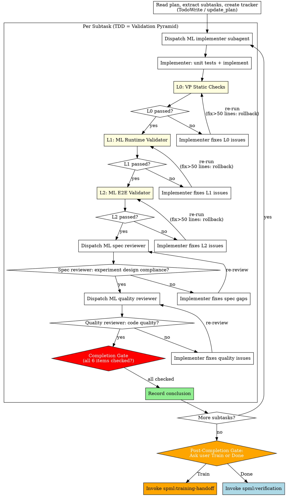

# ml-subagent-dev Completion Gate Implementation Plan

> **For agentic workers:** REQUIRED SUB-SKILL: Use superpowers:subagent-driven-development (recommended) or superpowers:executing-plans to implement this plan task-by-task. Steps use checkbox (`- [ ]`) syntax for tracking.

**Goal:** Fix ml-subagent-dev so subtask completion requires VP + Review evidence, with correct flow order and forced handoff decision.

**Architecture:** 6 targeted edits to a single skill file (`skills/ml-subagent-dev/SKILL.md`). Changes: add HARD-GATE + anti-pattern block, reorder flow (TDD=VP → Review), add Completion Gate node, update 3 prompts, replace silent handoff decision with mandatory user question.

**Tech Stack:** Markdown (skill definition file)

---

### Task 1: Add HARD-GATE and Anti-Pattern blocks

**Files:**
- Modify: `skills/ml-subagent-dev/SKILL.md:4-22` (between frontmatter and existing intro)

- [ ] **Step 1: Insert HARD-GATE block after frontmatter, before the `# ML Subagent-Driven Development` heading**

Replace lines 5-22 (from the blank line after frontmatter through the bullet list of key changes) with:

```markdown

<HARD-GATE>
Every subtask MUST complete ALL of the following before it can be marked complete.
No exceptions. No "this is too simple". No "this is just a toy experiment".

A subtask without VP results and Review results is NOT complete. Period.

## Subtask Completion Gate

Before marking ANY subtask as complete, you MUST have:

- [ ] L0: VP Static Checks — passed (with actual numbers recorded)
- [ ] L1: ML Runtime Validator — passed (with actual metrics recorded)
- [ ] L2: ML E2E Validator — passed (with actual pipeline stages confirmed)
- [ ] Spec Review — passed (experiment design compliance confirmed)
- [ ] Quality Review — passed (code quality confirmed)
- [ ] Conclusion recorded — with metric evidence from VP

If ANY item is unchecked, the subtask is NOT complete.
Do NOT proceed to the next subtask. Do NOT mark it as done.
</HARD-GATE>

## Anti-Pattern: "This Subtask Doesn't Need Full VP"

This is the single most dangerous rationalization in ML experiments.

| Thought | Reality |
|---------|---------|
| "This is just a toy experiment" | Toy experiments with wrong gradients waste days of debugging |
| "The model code is simple" | Simple code with silent shape bugs produces plausible but wrong results |
| "Unit tests already passed" | Unit tests check deterministic logic. VP checks training dynamics. They test different things. |
| "L1/L2 is overkill for this subtask" | If this subtask is part of an ML experiment, it WILL be trained and evaluated. VP validates that. |
| "I'll run VP at the end" | VP per subtask catches bugs early. VP at the end means debugging the entire codebase at once. |
| "The user wants speed" | Skipping VP and debugging silent failures later is SLOWER. |

ML experiments ALWAYS involve a training-evaluation pipeline. Even outputting "loss is decreasing" is evaluation. If there is a pipeline, there is a VP. No exceptions.

# ML Subagent-Driven Development

Execute ML experiment plans by dispatching fresh subagent per subtask, with ML-adapted review criteria: spec compliance (does it match experiment design?), quality review (did Validation Pyramid pass?), and conclusion recording.

**Core principle:** Fresh subagent per subtask + experiment-aware review + conclusion recording = correct implementations with trustworthy conclusions.

**Adapted from:** `superpowers:subagent-driven-development`. Key changes:
- TDD = Validation Pyramid: unit tests → implement → L0 → L1 → L2, THEN Spec Review → Quality Review
- L0: VP Static Checks subagent checks static ML correctness
- L1: Runtime validation (minutes-level training run with metrics collection)
- L2: E2E pipeline validation (1-5 steps per stage)
- Spec reviewer checks experiment design compliance (hypothesis, variable control)
- Quality reviewer checks code quality (VP results already validated by orchestrator)
- Each subtask records: metric data, conclusion, anomaly log
- Shared fix loop: fail → Implementer fixes → re-run level → 5 failures → user intervention
- Large fix rollback: fix > 50 lines → re-run all prior reviews + VP levels
```

- [ ] **Step 2: Verify the edit**

Read lines 1-60 of `skills/ml-subagent-dev/SKILL.md` and confirm:
- Frontmatter unchanged (lines 1-3)
- HARD-GATE block appears immediately after frontmatter
- Anti-Pattern table appears after HARD-GATE
- `# ML Subagent-Driven Development` heading follows
- Key changes bullet list reflects new TDD=VP order

- [ ] **Step 3: Commit**

```bash
git add skills/ml-subagent-dev/SKILL.md
git commit -m "fix(ml-subagent-dev): add HARD-GATE and anti-pattern blocks to prevent VP skip"
```

---

### Task 2: Rewrite the flow diagram with new order + Completion Gate

**Files:**
- Modify: `skills/ml-subagent-dev/SKILL.md` — the `digraph process` block (lines 48-108)

- [ ] **Step 1: Replace the entire flow diagram**

Replace from ` ```dot` through the closing ` ``` ` (the full digraph block) with:

````markdown

````

- [ ] **Step 2: Verify the diagram**

Read the diagram section and confirm:
- Subgraph label says "Per Subtask (TDD = Validation Pyramid)"
- Order: Implement → L0 → L1 → L2 → Spec Review → Quality Review → Completion Gate → Record Conclusion
- Completion Gate node is red
- Post-Completion Gate asks user (replaces "Needs long-running training?" diamond)
- fix>50 lines rollback labels preserved on L0/L1/L2 fix edges

- [ ] **Step 3: Commit**

```bash
git add skills/ml-subagent-dev/SKILL.md
git commit -m "fix(ml-subagent-dev): reorder flow TDD=VP, add Completion Gate and forced handoff"
```

---

### Task 3: Update Implementer Prompt

**Files:**
- Modify: `skills/ml-subagent-dev/SKILL.md` — the `## ML Implementer Subagent Prompt` section

- [ ] **Step 1: Replace the Note line in the Implementer prompt**

Find this line inside the implementer prompt code block:
```
Note: Validation Pyramid (L0/L1/L2) is run by the orchestrator AFTER your code passes reviews. You do NOT run VP yourself.
```

Replace with:
```
Note: After your code passes unit tests, the orchestrator will run Validation Pyramid (L0/L1/L2) as part of TDD, THEN Spec Review and Quality Review. You do NOT run VP or reviews yourself.
```

- [ ] **Step 2: Verify the edit**

Read the Implementer prompt section and confirm the Note reflects the new order.

- [ ] **Step 3: Commit**

```bash
git add skills/ml-subagent-dev/SKILL.md
git commit -m "fix(ml-subagent-dev): update implementer prompt note for new flow order"
```

---

### Task 4: Update Spec Reviewer Prompt

**Files:**
- Modify: `skills/ml-subagent-dev/SKILL.md` — the `## ML Spec Reviewer Prompt` section

- [ ] **Step 1: Add VP context at the top of the Spec Reviewer prompt code block**

After the line:
```
You are reviewing whether a subtask implementation matches its experiment design.
```

Insert:
```

## Context

VP (L0/L1/L2) has already passed before this review. You can reference VP results when checking experiment design compliance — e.g., if L1 showed loss not decreasing, that's relevant to whether the hypothesis implementation is correct.
```

- [ ] **Step 2: Verify the edit**

Read the Spec Reviewer prompt section and confirm the Context block appears right after the opening line.

- [ ] **Step 3: Commit**

```bash
git add skills/ml-subagent-dev/SKILL.md
git commit -m "fix(ml-subagent-dev): add VP context to spec reviewer prompt"
```

---

### Task 5: Update Quality Reviewer Prompt

**Files:**
- Modify: `skills/ml-subagent-dev/SKILL.md` — the `## ML Quality Reviewer Prompt` section

- [ ] **Step 1: Replace the Note line in the Quality Reviewer prompt code block**

Find:
```
Note: Validation Pyramid (L0/L1/L2) runs AFTER this quality review. You review code quality only — VP metrics are the orchestrator's responsibility.
```

Replace with:
```
Note: VP (L0/L1/L2) and Spec Review have already passed before this review. Your focus is purely code quality. VP metrics are already validated by the orchestrator.
```

- [ ] **Step 2: Verify the edit**

Read the Quality Reviewer prompt section and confirm the Note reflects that VP and Spec Review are upstream.

- [ ] **Step 3: Commit**

```bash
git add skills/ml-subagent-dev/SKILL.md
git commit -m "fix(ml-subagent-dev): update quality reviewer prompt for new flow order"
```

---

### Task 6: Rewrite Training Handoff Decision section

**Files:**
- Modify: `skills/ml-subagent-dev/SKILL.md` — the `## Training Handoff Decision` section

- [ ] **Step 1: Replace the entire Training Handoff Decision section**

Find the section starting with `## Training Handoff Decision` (line 247) through the end of the downstream checks bullet list (line 268). Replace with:

```markdown
## Post-Completion Gate

<HARD-GATE>
After ALL subtasks are complete (all Completion Gates passed), you MUST pause and present the following to the user. Do NOT decide this yourself. Do NOT skip this question. Do NOT proceed to verification or training-handoff without asking.
</HARD-GATE>

Present to the user:

> All subtasks complete. VP passed. Next step:
>
> 1. **Train** — needs long-running training (hours/days). I will invoke spml:training-handoff to generate experiment-context.md + watchdog-prompt.md for a new monitoring session.
> 2. **Done** — experiment is already complete within this session. I will invoke spml:verification.
>
> Which one?

- **User chooses Train** → Invoke `spml:training-handoff`. This generates:
  - Production training script with human-readable logging (including MFU, gradient norms, etc.)
  - `experiment-context.md` with VP baseline metrics
  - `watchdog-prompt.md` for monitoring in a separate session
  - Verification happens LATER, after training completes (via `spml:training-resume`)

- **User chooses Done** → Invoke `spml:verification` directly. The experiment is already complete within this session.

When the long-running phase includes evaluation, downstream checks should confirm:
- in-training evaluation fires at the planned step cadence
- checkpoint-based evaluation reports checkpoint load behavior
- in-training evaluation reports that it is using in-memory state
- evaluation start/end messages and progress output appear as runtime checks, not optional niceties
- evaluation errors surface with mode-aware context at the evaluation boundary
```

- [ ] **Step 2: Verify the edit**

Read the Post-Completion Gate section and confirm:
- HARD-GATE block present
- User-facing question with two options
- Both paths documented
- Downstream evaluation checks preserved

- [ ] **Step 3: Commit**

```bash
git add skills/ml-subagent-dev/SKILL.md
git commit -m "fix(ml-subagent-dev): replace silent handoff decision with mandatory user question"
```

---

### Task 7: Final verification

- [ ] **Step 1: Read the entire modified SKILL.md**

Read `skills/ml-subagent-dev/SKILL.md` from top to bottom and verify:
- HARD-GATE appears first (after frontmatter)
- Anti-Pattern table follows HARD-GATE
- Flow diagram shows: Implement → L0 → L1 → L2 → Spec Review → Quality Review → Completion Gate → Record Conclusion
- Completion Gate is red in diagram
- Post-Completion Gate replaces "Needs long-running training?" with mandatory user question
- Implementer prompt Note updated
- Spec Reviewer prompt has VP Context block
- Quality Reviewer prompt Note updated
- No leftover references to old order

- [ ] **Step 2: Check for internal contradictions**

Grep for any remaining text that says VP runs "after reviews" or similar old-order language:
```bash
grep -n -i "after.*review.*VP\|after.*quality.*L0\|VP.*after.*spec" skills/ml-subagent-dev/SKILL.md
```
Expected: no matches.

- [ ] **Step 3: Final commit if any fixups needed**

Only if Step 2 found stale references — fix and commit.
