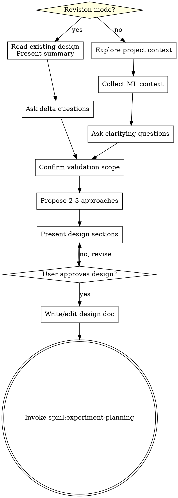

> **Note:** References to L2/ml-e2e-validator in this plan are stale — L2 has been merged into L1. See `docs/superpowers/specs/2026-03-29-vp-l1-l2-merge-design.md`.

# Experiment Re-entry Implementation Plan

> **For agentic workers:** REQUIRED SUB-SKILL: Use superpowers:subagent-driven-development (recommended) or superpowers:executing-plans to implement this plan task-by-task. Steps use checkbox (`- [ ]`) syntax for tracking.

**Goal:** Make experiment directories maintainable by adding re-entry support — directory state detection, revision modes for brainstorming/planning/subagent-dev, cleanup of redundant skills, and VP timeout protection.

**Architecture:** 8 changes across skill markdown files. Entry routing scans experiment directory to determine state (empty/design/plan/code), then invokes the appropriate skill in either "new" or "revision" mode. Redundant skills (training-resume, executing-plans) are deleted. VP layers get timeout protection for background execution.

**Tech Stack:** Markdown (skill definition files)

---

## File Structure

**Modified:**
- `skills/using-superpowers-ml/SKILL.md` — add directory state detection + routing
- `skills/ml-brainstorming/SKILL.md` — add revision mode
- `skills/experiment-planning/SKILL.md` — add revision mode + update execution handoff
- `skills/ml-subagent-dev/SKILL.md` — add revision mode adaptation + update integration + fix training-resume reference
- `skills/watchdog/SKILL.md` — replace training-resume/recovery-prompt/completion-prompt references
- `skills/training-handoff/SKILL.md` — remove completion-prompt reference from watchdog-prompt template
- `skills/ml-runtime-validator/SKILL.md` — add background execution timeout
- `skills/ml-e2e-validator/SKILL.md` — add background execution timeout

**Deleted:**
- `skills/training-resume/SKILL.md`
- `skills/executing-plans/SKILL.md`

---

### Task 1: Add directory state detection to `using-superpowers-ml`

**Files:**
- Modify: `skills/using-superpowers-ml/SKILL.md:28-48`

- [ ] **Step 1: Insert Experiment Directory Detection section after "ML Experiment Gate" section**

Find the line:
```
**The key question: Is the goal to observe an experimental outcome, or to ship working software?**
- Observe outcome → SPML
- Ship software → Superpowers (even if the software is ML-related)
```

Insert the following AFTER the "Experiment directory override" paragraph (after line 50) and BEFORE `## The Rule` (line 52):

```markdown
## Experiment Directory Detection

Before routing to any skill, check if the user's request references an existing experiment directory.

**Detection:**
1. **Explicit path** — user mentions a directory like "experiments/xxx" or "modify the gumbel experiment"
2. **Implicit** — user references an experiment and there's only one experiment directory

**If an experiment directory is identified, scan it:**

<HARD-GATE>
When an experiment directory with existing artifacts is detected, you MUST read all existing design docs and plans BEFORE invoking any skill. Pass their content as context to the invoked skill.

Do NOT create new design/plan files when existing ones can be revised.
Do NOT let any skill skip reading existing artifacts.
</HARD-GATE>

**State detection:**

```
Scan <experiment-dir>/plans/:
  - *-design.md exists? → has_design = true
  - non-design *.md exists? → has_plan = true

Scan <experiment-dir>/:
  - *.py exists? → has_code = true
```

**Routing based on state:**

| has_design | has_plan | has_code | Action |
|------------|----------|----------|--------|
| false | false | false | New experiment: invoke `spml:ml-brainstorming` (new mode) |
| true | false | false | Read design → invoke `spml:experiment-planning` |
| true | true | false | Read plan → invoke `spml:ml-subagent-dev` |
| true | true | true | Read design → invoke `spml:ml-brainstorming` (revision mode) |

**Last row is critical:** When a full experiment exists and the user wants changes, ALWAYS start from the design. Changes propagate top-down: design → plan → code. Direct code changes without design/plan updates are forbidden.
```

- [ ] **Step 2: Verify the edit**

Read lines 48-95 of `skills/using-superpowers-ml/SKILL.md` and confirm:
- New section appears between "Experiment directory override" and "## The Rule"
- HARD-GATE block present
- State detection table with 4 rows
- Top-down propagation principle stated

- [ ] **Step 3: Commit**

```bash
git add skills/using-superpowers-ml/SKILL.md
git commit -m "feat(using-spml): add experiment directory state detection and routing"
```

---

### Task 2: Add revision mode to `ml-brainstorming`

**Files:**
- Modify: `skills/ml-brainstorming/SKILL.md:36-61` (after checklist, before process flow)

- [ ] **Step 1: Insert Revision Mode section after the Checklist section**

Find the line:
```
8. **Transition to implementation** — invoke `spml:experiment-planning` skill to create implementation plan
```

Insert the following AFTER that line and BEFORE `## Process Flow`:

```markdown

## Revision Mode

When the orchestrator passes existing design doc content (from directory state detection), you are in revision mode.

<HARD-GATE>
In revision mode, you MUST edit the existing design doc in place. Do NOT create a new design file. Do NOT re-ask questions that are already answered in the existing design.
</HARD-GATE>

### What changes in revision mode:
- Read and present the existing design summary first:
  > "Current design: [1-3 sentence summary of hypothesis, approach, validation scope]. What do you want to change?"
- Skip "Collecting ML Context" questions that already have answers (hypothesis, variables, dataset, architecture, scale, etc.)
- Only ask questions about the **delta** — what's changing and why
- Edit the existing design doc in place
- Commit: `"experiment: revise design — [what changed]"`

### What stays the same:
- User approval required before proceeding
- Spec self-review still runs
- Transitions to `spml:experiment-planning` (which will also be in revision mode)

### Impact tracking:
After revision, append an Impact section to the design doc:

```markdown
## Impact on Plan
- Subtask N: [needs update because X changed]
- Subtask M: [unaffected]
- New subtask needed: [description]
```

This Impact section guides downstream plan revision.

### Checklist (revision mode):
1. **Read existing design** — present summary to user
2. **Ask delta questions** — only what's changing
3. **Confirm validation scope changes** — if any VP levels need re-evaluation
4. **Present revised design sections** — only changed sections, get approval
5. **Edit design doc in place** — with Impact on Plan section
6. **Transition** — invoke `spml:experiment-planning` (revision mode)
```

- [ ] **Step 2: Update the Process Flow diagram to include revision mode**

Find the diagram:
```dot
digraph ml_brainstorming {
```

Replace the entire diagram (from opening ```dot to closing ```) with:

````

````

- [ ] **Step 3: Verify the edit**

Read the full file and confirm:
- Revision Mode section appears after checklist, before process flow
- HARD-GATE inside revision mode
- Diagram has "Revision mode?" decision diamond
- Both paths (new and revision) converge at "Confirm validation scope"

- [ ] **Step 4: Commit**

```bash
git add skills/ml-brainstorming/SKILL.md
git commit -m "feat(ml-brainstorming): add revision mode for existing experiment designs"
```

---

### Task 3: Add revision mode to `experiment-planning`

**Files:**
- Modify: `skills/experiment-planning/SKILL.md:16-17` (after save location, before Code Separation)

- [ ] **Step 1: Insert Revision Mode section after the "Save plans to" line**

Find the line:
```
**Save plans to:** `<experiment_dir>/plans/YYYY-MM-DD-<experiment-name>.md` (use the experiment directory from the brainstorm design doc)
```

Insert the following AFTER that line and BEFORE `## Code Separation Principle`:

```markdown

## Revision Mode

When the orchestrator passes existing plan content AND a revised design with "## Impact on Plan" section, you are in revision mode.

<HARD-GATE>
In revision mode, you MUST edit the existing plan file in place. Do NOT create a new plan file. Preserve subtask numbering for unaffected subtasks.
</HARD-GATE>

### Flow:
1. Read existing plan fully
2. Read design's "Impact on Plan" section — which subtasks are affected
3. For each affected subtask: rewrite steps to match revised design, preserve subtask number
4. For new subtasks: append to end of plan (Task N+1, N+2, ...)
5. For removed subtasks: mark as `REMOVED: [reason]` (don't delete — human needs to see what was dropped)
6. Edit existing plan file in place
7. Commit: `"experiment: revise plan — [what changed]"`

### Marking subtask status:
Unchanged subtasks that already passed VP keep their results:
```
- [x] Task 1: ... (unchanged, VP passed)
- [ ] Task 2: ... (REVISED — needs re-execution)
- [ ] Task 5: ... (NEW)
```

### What stays the same:
- Plan Gate still applies (evaluation subtask, cadence, etc.)
- Self-review still runs
- Transitions to `spml:ml-subagent-dev` for execution of changed/new subtasks only
```

- [ ] **Step 2: Update the Execution Handoff section**

Find:
```
**If Parallel Session chosen:**
- Guide them to open new session
- **REQUIRED SUB-SKILL:** New session uses spml:executing-plans
```

Replace with:
```
**If Parallel Session chosen:**
- Guide them to open new session
- **REQUIRED SUB-SKILL:** New session uses superpowers:executing-plans
```

- [ ] **Step 3: Verify the edit**

Read the file and confirm:
- Revision Mode section appears after save location, before Code Separation
- HARD-GATE inside revision mode
- Subtask status marking format matches spec
- Execution Handoff references `superpowers:executing-plans` (not `spml:executing-plans`)

- [ ] **Step 4: Commit**

```bash
git add skills/experiment-planning/SKILL.md
git commit -m "feat(experiment-planning): add revision mode, fix executing-plans reference"
```

---

### Task 4: Add revision mode adaptation to `ml-subagent-dev`

**Files:**
- Modify: `skills/ml-subagent-dev/SKILL.md` (after Plan Gate, before The Process)

- [ ] **Step 1: Insert Revision Mode Adaptation section**

Find the line:
```
Do not treat these as advisory. Incomplete plans must be sent back for revision before implementation starts.
```

Insert the following AFTER that line and BEFORE `## The Process`:

```markdown

## Revision Mode Adaptation

When the plan contains revision markers (`[x]`, `REVISED`, `NEW`), apply these rules:

- **`[x]` (unchanged, VP passed)** — Skip entirely. VP results preserved, no re-execution needed.
- **`[ ] REVISED`** — Re-execute on existing code:
  - Implementer subagent receives the old code file paths as context
  - Implementer modifies existing code (not from scratch)
  - VP must fully re-run (L0 → L1 → L2) — old VP results are voided
  - Spec Review + Quality Review must re-run
- **`[ ] NEW`** — Normal fresh flow, same as non-revision mode

Completion Gate is unchanged — all re-executed subtasks must pass the full gate before marking complete.
```

- [ ] **Step 2: Fix training-resume reference in Post-Completion Gate**

Find this line in the Post-Completion Gate section:
```
  - Verification happens LATER, after training completes (via `spml:training-resume`)
```

Replace with:
```
  - Verification happens LATER, after training completes (re-enter experiment directory in new session)
```

- [ ] **Step 3: Update Integration section**

Find the Integration section and remove the training-resume reference. The current integration list doesn't reference training-resume directly, but verify there are no stale references.

Also check: is there a reference to `spml:executing-plans`? If so, change to `superpowers:executing-plans`.

Read the Integration section and verify it's clean.

- [ ] **Step 4: Verify all edits**

Read the relevant sections and confirm:
- Revision Mode Adaptation section present with 3 marker types
- No `spml:training-resume` references remain
- No `spml:executing-plans` references remain

- [ ] **Step 5: Commit**

```bash
git add skills/ml-subagent-dev/SKILL.md
git commit -m "feat(ml-subagent-dev): add revision mode adaptation, remove training-resume reference"
```

---

### Task 5: Update `watchdog` — remove training-resume, recovery-prompt, completion-prompt

**Files:**
- Modify: `skills/watchdog/SKILL.md`

- [ ] **Step 1: Update Tier 1 Monitor action**

Find:
```
**Action (Monitor):** Write diagnosis to experiment-context.md, generate recovery-prompt.md, notify user.
```

Replace with:
```
**Action (Monitor):** Write diagnosis to experiment-context.md. Notify user: "Training issue: [description]. Start a new session on the experiment directory to continue."
```

- [ ] **Step 2: Update Tier 2 Monitor action**

Find:
```
**Action (Monitor):** Write diagnosis to experiment-context.md, generate recovery-prompt.md, notify user.
```

(This is the second occurrence, in the Tier 2 section)

Replace with:
```
**Action (Monitor):** Write diagnosis to experiment-context.md. Notify user: "Training issue: [description]. Start a new session on the experiment directory to continue."
```

- [ ] **Step 3: Update Tier 3 Autonomous action**

Find:
```
1. Write diagnosis to experiment-context.md
2. Generate recovery-prompt.md
3. Spawn sub-agent using Claude Code's Agent tool with instructions: read recovery-prompt.md, follow training-resume flow, fix issue, restart training
```

Replace with:
```
1. Write diagnosis to experiment-context.md
2. Spawn sub-agent using Claude Code's Agent tool with instructions: read experiment-context.md diagnosis, fix the identified issue, restart training
```

- [ ] **Step 4: Update Tier 3 Guardian/Monitor actions**

Find:
```
**Action (Guardian):** Write diagnosis to experiment-context.md, generate recovery-prompt.md, notify user. Wait for user to handle the issue.

**Action (Monitor):** Same as Guardian.
```

Replace with:
```
**Action (Guardian):** Write diagnosis to experiment-context.md. Notify user: "Training issue: [description]. Start a new session on the experiment directory to continue." Wait for user to handle the issue.

**Action (Monitor):** Same as Guardian.
```

- [ ] **Step 5: Replace Completion Mode Step 4 (completion-prompt.md)**

Find the entire "### Step 4: Produce completion-prompt.md" section (lines 234-246). Replace with:

```markdown
### Step 4: Notify User

```
Training complete. [total_steps] steps in [duration].
Final loss: [val].
Interventions: [N restarts, N parameter changes, N sub-agent fixes].

Start a new session on the experiment directory to analyze results and conclude the experiment.
```
```

- [ ] **Step 6: Replace Completion Mode Step 5 (Notify User)**

The old Step 5 (lines 249-255) referenced "paste the contents of completion-prompt.md". Since we replaced Step 4 with the notification, delete the old Step 5 entirely (it's now merged into the new Step 4).

Find:
```
### Step 5: Notify User

```
Training complete. [total_steps] steps in [duration].
Final loss: [val].
Interventions: [N restarts, N parameter changes, N sub-agent fixes].
To analyze results: open a new agent session and paste the contents of completion-prompt.md.
```
```

Delete this entire section (it's replaced by the new Step 4).

- [ ] **Step 7: Update Integration section**

Find:
```
- **spml:training-resume** — Invoked by sub-agents in Autonomous mode; consumes recovery/completion prompts in Monitor/Guardian mode
```

Replace with:
```
- **spml:diagnostics** — Sub-agents in Autonomous mode may invoke this for deeper analysis
```

Wait — check if diagnostics is already listed. Read the Integration section. Current content:
```
- **spml:training-handoff** — Produces the context and prompt that starts this skill
- **spml:training-resume** — Invoked by sub-agents in Autonomous mode; consumes recovery/completion prompts in Monitor/Guardian mode
- **spml:diagnostics** — Sub-agents in Autonomous mode may invoke this for deeper analysis
```

So just delete the training-resume line:

Find:
```
- **spml:training-resume** — Invoked by sub-agents in Autonomous mode; consumes recovery/completion prompts in Monitor/Guardian mode
```

Delete this line entirely.

- [ ] **Step 8: Verify all edits**

Read the full file. Grep for "recovery-prompt", "completion-prompt", "training-resume". Expected: no matches.

- [ ] **Step 9: Commit**

```bash
git add skills/watchdog/SKILL.md
git commit -m "fix(watchdog): remove training-resume/recovery-prompt/completion-prompt, use unified re-entry"
```

---

### Task 6: Update `training-handoff` — remove completion-prompt reference from watchdog-prompt template

**Files:**
- Modify: `skills/training-handoff/SKILL.md`

- [ ] **Step 1: Update watchdog-prompt.md template**

Find this line inside the watchdog-prompt.md template (Step 5):
```
- Producing completion-prompt.md when training finishes
```

Replace with:
```
- Notifying you when training finishes or encounters issues
```

- [ ] **Step 2: Update launch instructions**

Find the Step 6 launch instructions. The current text says:
```
To start:
  1. Open a new agent session
  2. Paste the contents of watchdog-prompt.md
  3. The Watchdog will launch training and begin monitoring
```

This is fine for now (the separate watchdog UX improvement is a different spec). Leave it unchanged.

- [ ] **Step 3: Update Integration section**

Find:
```
- **spml:verification** — Skipped at handoff; entered later via resume
```

Replace with:
```
- **spml:verification** — Skipped at handoff; entered later via re-entry on experiment directory
```

- [ ] **Step 4: Verify edits**

Read the file. Grep for "completion-prompt", "training-resume". Expected: no matches.

- [ ] **Step 5: Commit**

```bash
git add skills/training-handoff/SKILL.md
git commit -m "fix(training-handoff): remove completion-prompt reference, update integration"
```

---

### Task 7: Delete `training-resume` and `executing-plans`

**Files:**
- Delete: `skills/training-resume/SKILL.md`
- Delete: `skills/executing-plans/SKILL.md`

- [ ] **Step 1: Delete training-resume**

```bash
rm skills/training-resume/SKILL.md
rmdir skills/training-resume
```

- [ ] **Step 2: Delete executing-plans**

```bash
rm skills/executing-plans/SKILL.md
rmdir skills/executing-plans
```

- [ ] **Step 3: Verify no remaining references**

Grep the entire `skills/` directory for "training-resume" and "spml:executing-plans". Expected: no matches (all references were updated in previous tasks).

```bash
grep -r "training-resume" skills/
grep -r "spml:executing-plans" skills/
```

If any matches found, fix them.

- [ ] **Step 4: Commit**

```bash
git add -A skills/training-resume/ skills/executing-plans/
git commit -m "chore: delete training-resume and executing-plans skills (replaced by unified re-entry)"
```

---

### Task 8: Add VP background execution timeout to `ml-runtime-validator`

**Files:**
- Modify: `skills/ml-runtime-validator/SKILL.md:86-98` (Timeout Protection section)

- [ ] **Step 1: Extend the Timeout Protection section**

Find the current Timeout Protection section:
```markdown
## Timeout Protection

L1 default runtime: 5 minutes. User can override during brainstorming. Timeout = configured runtime x 1.5.
```

Replace the entire section (from `## Timeout Protection` through the end of the timeout code block, line 98) with:

```markdown
## Timeout Protection

L1 default runtime: 5 minutes. User can override during brainstorming.

**Total timeout:** 10 minutes (configured runtime x 2, minimum 10 minutes).

**Background execution liveness check:**
When L1 dispatches training to background execution, the orchestrator MUST monitor it:

1. Start a check loop at **30-second intervals**
2. Each check: is the process still running? Has total timeout been exceeded?
3. **Timeout exceeded** → kill the background process → report as timeout failure → enter fix loop (same as any VP failure)
4. **Process completes within timeout** → read output → continue normal L1 metric analysis

```
Start runtime validation
    -> Background execution with 30s liveness checks
    -> Total timeout: 10 minutes
    -> Normal completion -> check metrics
    -> Timeout -> kill process
        -> Analyze hang cause (deadlock, communication block, data loading stuck)
        -> Send to Implementer for fix
        -> Counts toward 5-retry limit
```

**Critical:** Do NOT dispatch to background and then wait indefinitely. A hung process with no timeout detection will stall the entire VP flow.
```

- [ ] **Step 2: Verify the edit**

Read the Timeout Protection section and confirm:
- Total timeout: 10 minutes
- 30-second liveness check interval
- Kill → fix loop on timeout
- "Critical" warning about indefinite waits

- [ ] **Step 3: Commit**

```bash
git add skills/ml-runtime-validator/SKILL.md
git commit -m "fix(ml-runtime-validator): add background execution liveness check with 10min timeout"
```

---

### Task 9: Add VP background execution timeout to `ml-e2e-validator`

**Files:**
- Modify: `skills/ml-e2e-validator/SKILL.md:63-65` (Timeout Protection section)

- [ ] **Step 1: Extend the Timeout Protection section**

Find the current section:
```markdown
## Timeout Protection

Each stage has a default timeout of 2 minutes (configurable). Single stage hanging beyond timeout is killed and counts as a failure. The entire L2 run has an overall timeout of 10 minutes.
```

Replace with:

```markdown
## Timeout Protection

**Per-stage timeout:** 2 minutes (configurable). Single stage hanging beyond timeout is killed and counts as a failure.

**Overall timeout:** 15 minutes for the entire L2 run.

**Background execution liveness check:**
When L2 dispatches pipeline stages to background execution, the orchestrator MUST monitor them:

1. Start a check loop at **30-second intervals**
2. Each check: is the process still running? Has per-stage or overall timeout been exceeded?
3. **Timeout exceeded** → kill the background process → report which stage timed out → enter fix loop (same as any VP failure)
4. **Process completes within timeout** → read output → continue to next stage

**Critical:** Do NOT dispatch to background and then wait indefinitely. A hung process with no timeout detection will stall the entire VP flow.
```

- [ ] **Step 2: Verify the edit**

Read the Timeout Protection section and confirm:
- Per-stage timeout: 2 minutes
- Overall timeout: 15 minutes
- 30-second liveness check interval
- Kill → fix loop on timeout

- [ ] **Step 3: Commit**

```bash
git add skills/ml-e2e-validator/SKILL.md
git commit -m "fix(ml-e2e-validator): add background execution liveness check with 15min overall timeout"
```

---

### Task 10: Final verification

- [ ] **Step 1: Grep for all stale references**

```bash
grep -r "training-resume" skills/
grep -r "spml:executing-plans" skills/
grep -r "recovery-prompt" skills/
grep -r "completion-prompt" skills/
```

Expected: no matches for any of these.

- [ ] **Step 2: Verify deleted files are gone**

```bash
ls skills/training-resume/ 2>&1
ls skills/executing-plans/ 2>&1
```

Expected: "No such file or directory" for both.

- [ ] **Step 3: Read key sections for consistency**

Read these sections and verify they reference the correct skills/concepts:
- `skills/using-superpowers-ml/SKILL.md` — has Experiment Directory Detection section
- `skills/ml-brainstorming/SKILL.md` — has Revision Mode section
- `skills/experiment-planning/SKILL.md` — has Revision Mode section, references `superpowers:executing-plans`
- `skills/ml-subagent-dev/SKILL.md` — has Revision Mode Adaptation, no training-resume refs
- `skills/watchdog/SKILL.md` — no recovery-prompt/completion-prompt/training-resume refs
- `skills/training-handoff/SKILL.md` — no completion-prompt refs

- [ ] **Step 4: Commit fixups if any stale references found**

Only if Steps 1-3 found issues.
