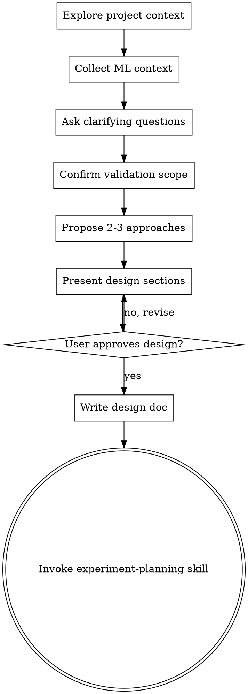

# ML Brainstorming: Ideas Into Experiment Designs

## Overview

Help turn ML ideas into fully formed experiment designs through natural collaborative dialogue.

Start by understanding the current project context, then ask questions one at a time to refine the idea. Once you understand what you're building, present the design and get user approval.

**Core ML principle:** "Not working" is reasonable in ML, but the process must be correct. A bad implementation mistaken for a bad strategy wastes entire research directions. This skill ensures we design experiments that can distinguish the two.

<HARD-GATE>
Do NOT invoke any implementation skill, write any code, scaffold any project, or take any implementation action until you have presented a design and the user has approved it. This applies to EVERY project regardless of perceived simplicity.
</HARD-GATE>

## Anti-Pattern: "This Is Too Simple To Need A Design"

Every project goes through this process. A single ablation, a data pipeline tweak, a hyperparameter sweep — all of them. "Simple" ML tasks are where unexamined assumptions cause the most wasted GPU hours. The design can be short, but you MUST present it and get approval.

## Checklist

You MUST create a task for each of these items and complete them in order:

1. **Explore project context** — check files, docs, recent commits, existing model/training code
2. **Collect ML context** — architecture, task type, scale, existing infra
3. **Ask clarifying questions** — one at a time, understand hypothesis/constraints/success criteria
4. **Confirm validation scope** — which Validation Pyramid layers apply, which to skip
5. **Propose 2-3 approaches** — with trade-offs and your recommendation
6. **Present design** — in sections scaled to their complexity, get user approval after each section
7. **Write design doc** — save to `docs/plans/YYYY-MM-DD-<topic>-design.md` and commit
8. **Transition to implementation** — invoke experiment-planning skill to create implementation plan

## Process Flow

**The terminal state is invoking experiment-planning.** Do NOT invoke any other implementation skill.

## The Process

### Understanding the idea
- Check out the current project state first (files, docs, recent commits, model code)
- Ask questions one at a time to refine the idea
- Prefer multiple choice questions when possible
- Only one question per message
- Focus on understanding: hypothesis, constraints, success criteria

### Collecting ML context
Ask about (one at a time, skip what's already clear):
- **Model architecture** — Transformer / MoE / CNN / RNN / other? Custom layers?
- **Task type** — RecSys / LLM pretraining / LLM fine-tuning / CV / RL / other?
- **Scale** — Single GPU / multi-GPU / multi-node?
- **Existing infra** — What's already built and tested? (data pipeline, training loop, checkpoint, evaluation)
  - Existing infra = don't touch, only advise if problems found
- **Custom components** — Any custom loss, custom layers, custom operators that need unit tests?
- **Model structure decomposition** — For efficiency validation, what's a reasonable segmentation? (e.g., attention block / FFN block / MoE routing)

### Experiment design (when applicable)
For experiment/ablation tasks, clarify:
- **Hypothesis:** Doing X is expected to cause Y
- **Independent variable:** What changes in this experiment
- **Dependent variable:** What metrics to observe
- **Control variable:** What stays the same

### Confirming validation scope
Walk through the Validation Pyramid layers. For each, ask: needed / skip / already covered by existing infra?

**L0: Engineering Efficiency**
- Backend checks (FA, MoE backend, CUDA kernels)
- Bandwidth (NCCL, HBM, PCIE) — multi-node/multi-GPU only
- GPU efficiency (MFU, TCA)
- Infrastructure (checkpoint, W&B, sample consumption speed, memory)
- Data I/O speed

**L1: Process Metrics**
- Universal: gradient health, parameter drift, loss spike detection
- Architecture-specific (auto-recommend based on ML context):
  - Transformer: attention distribution, attention entropy
  - MoE: MoE entropy, load balance
  - Residual networks: residual stream write ratio
  - RecSys: embedding norm stability, negative sampling quality
  - LLM: per-token loss distribution, KV cache growth
- User can add or remove any check

**L2: Overfitting Test**
- Small-scale overfit on 100-1000 samples, fixed seed
- Loss must monotonically decrease to near 0

**L3: End-to-End Pipeline**
- Full flow (data -> training -> inference -> evaluation) on tiny data

**User can skip any layer entirely.** Record decisions in natural language in the design doc.

### Dataset preparation (when applicable)
If the task involves constructing or transforming datasets:
- Invoke **spml:data-preparation** for TDD-first dataset processing
- Dataset preparation runs independently from the training Validation Pyramid
- Complete data preparation before starting training subtasks

### Exploring approaches
- Propose 2-3 different approaches with trade-offs
- Present options conversationally with your recommendation and reasoning
- Lead with your recommended option and explain why

### Presenting the design
- Scale each section to its complexity
- Ask after each section whether it looks right so far
- Cover: experiment design, model/data architecture, validation scope, expected outcomes
- Be ready to go back and clarify

## After the Design

**Documentation:**
- Write the validated design to `docs/plans/YYYY-MM-DD-<topic>-design.md`
- Include validation scope decisions in the doc
- Commit the design document to git

**Implementation:**
- Invoke the experiment-planning skill to create a detailed implementation plan
- Do NOT invoke any other skill. experiment-planning is the next step.

## Key Principles

- **One question at a time** — Don't overwhelm with multiple questions
- **Multiple choice preferred** — Easier to answer than open-ended when possible
- **YAGNI ruthlessly** — Remove unnecessary features from all designs
- **Explore alternatives** — Always propose 2-3 approaches before settling
- **Incremental validation** — Present design, get approval before moving on
- **Be flexible** — Go back and clarify when something doesn't make sense
- **Code separation** — Core code (model, training, data) never imports test/validation code. After development, core code is production-deployable as-is.
