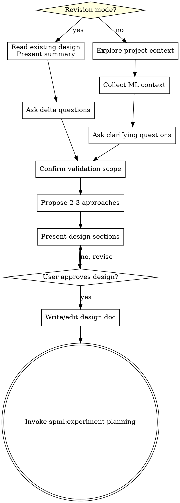

# ML Brainstorming: Ideas Into Experiment Designs

## Overview

Help turn ML ideas into fully formed experiment designs through natural collaborative dialogue.

Start by understanding the current project context, then ask questions one at a time to refine the idea. Once you understand what you're building, present the design and get user approval.

**Core ML principle:** "Not working" is reasonable in ML, but the process must be correct. A bad implementation mistaken for a bad strategy wastes entire research directions. This skill ensures we design experiments that can distinguish the two.

<HARD-GATE>
Do NOT invoke any implementation skill, write any code, scaffold any project, or take any implementation action until you have presented a design and the user has approved it. This applies to EVERY project regardless of perceived simplicity.
</HARD-GATE>

## Anti-Pattern: "This Is Too Simple To Need A Design"

Every project goes through this process. A single ablation, a data pipeline tweak, a hyperparameter sweep — all of them. "Simple" ML tasks are where unexamined assumptions cause the most wasted GPU hours. The design can be short, but you MUST present it and get approval.

## Checklist

You MUST create a task for each of these items and complete them in order:

1. **Explore project context** — check files, docs, recent commits, existing model/training code
2. **Collect ML context** — architecture, task type, scale, existing infra
3. **Ask clarifying questions** — one at a time, understand hypothesis/constraints/success criteria
4. **Confirm validation scope** — which Validation Pyramid layers apply, which to skip
5. **Propose 2-3 approaches** — with trade-offs and your recommendation
6. **Present design** — in sections scaled to their complexity, get user approval after each section
7. **Write design doc** — save to `<experiment_dir>/plans/YYYY-MM-DD-<topic>-design.md` and commit
8. **Transition to implementation** — invoke `spml:experiment-planning` skill to create implementation plan

## Revision Mode

When the orchestrator passes existing design doc content (from directory state detection), you are in revision mode.

<HARD-GATE>
In revision mode, you MUST edit the existing design doc in place. Do NOT create a new design file. Do NOT re-ask questions that are already answered in the existing design.
</HARD-GATE>

### What changes in revision mode:
- Read and present the existing design summary first:
  > "Current design: [1-3 sentence summary of hypothesis, approach, validation scope]. What do you want to change?"
- Skip "Collecting ML Context" questions that already have answers (hypothesis, variables, dataset, architecture, scale, etc.)
- Only ask questions about the **delta** — what's changing and why
- Edit the existing design doc in place
- Commit: `"experiment: revise design — [what changed]"`

### What stays the same:
- User approval required before proceeding
- Spec self-review still runs
- Transitions to `spml:experiment-planning` (which will also be in revision mode)

### Impact tracking:
After revision, append an Impact section to the design doc:

```markdown
## Impact on Plan
- Subtask N: [needs update because X changed]
- Subtask M: [unaffected]
- New subtask needed: [description]
```

This Impact section guides downstream plan revision.

### Checklist (revision mode):
1. **Read existing design** — present summary to user
2. **Ask delta questions** — only what's changing
3. **Confirm validation scope changes** — if any VP levels need re-evaluation
4. **Present revised design sections** — only changed sections, get approval
5. **Edit design doc in place** — with Impact on Plan section
6. **Transition** — invoke `spml:experiment-planning` (revision mode)

## Process Flow



**The terminal state is invoking `spml:experiment-planning`.** Do NOT invoke any other implementation skill.

## The Process

### Understanding the idea
- Check out the current project state first (files, docs, recent commits, model code)
- Ask questions one at a time to refine the idea
- Prefer multiple choice questions when possible
- Only one question per message
- Focus on understanding: hypothesis, constraints, success criteria

### Collecting ML context
Ask about (one at a time, skip what's already clear):
- **Experiment directory** — Where should experiment artifacts (plans, docs, logs) be stored? Ask for an explicit path relative to the project root (e.g., `experiments/my-experiment/`). All generated plans and docs will be saved under this directory.
- **Model architecture** — Transformer / MoE / CNN / RNN / other? Custom layers?
- **Task type** — RecSys / LLM pretraining / LLM fine-tuning / CV / RL / other?
- **Scale** — Single GPU / multi-GPU / multi-node?
- **Existing infra** — What's already built and tested? (data pipeline, training loop, checkpoint, evaluation)
  - Existing infra = don't touch, only advise if problems found
- **Evaluation shape** — Is evaluation required? If yes, what is the step-based cadence (`every N steps`) and does evaluation need both checkpoint-based and in-memory entry modes?
- **Evaluation scope** — Default to `full validation` unless the user explicitly wants a narrower scope
- **Evaluation observability** — How should long-running evaluation show progress? Require explicit phase messages, a dedicated progress bar, and result/efficiency summaries
- **Evaluation efficiency expectations** — What should be checked for checkpoint load latency, time-to-first-progress update, throughput, and long silent gaps?
- **Evaluation failure expectations** — What should happen for checkpoint missing/unreadable, restore failure, empty or misconfigured validation dataloader, metric aggregation failure, non-finite metrics, or stalled evaluation?
- **Custom components** — Any custom loss, custom layers, custom operators that need unit tests?
- **Model structure decomposition** — For efficiency validation, what's a reasonable segmentation? (e.g., attention block / FFN block / MoE routing)

### Experiment design (when applicable)
For experiment/ablation tasks, clarify:
- **Hypothesis:** Doing X is expected to cause Y
- **Independent variable:** What changes in this experiment
- **Dependent variable:** What metrics to observe
- **Control variable:** What stays the same

<HARD-GATE>
### Autoresearch Detection

If ANY of the following are true, you MUST immediately enter the autoresearch protocol definition flow below:

1. **Upstream activation** — `spml:autoresearch-create` was invoked earlier in this conversation (autoresearch mode is already confirmed)
2. **Keyword match** — the user mentions ANY of: **"auto research"**, **"autoresearch"**, **"automated research"**, **"automated experiment"**, **"auto optimize"**, **"自动研究"**, **"自动实验"**
3. **Pattern match** — even without explicit keywords:
   - Goal is to search/optimize rather than validate a single hypothesis
   - Multiple iterative attempts expected
   - "Find the best X" rather than "test whether X works"

**Do NOT explore the project first.** Do NOT dispatch Explore agents or read code before asking the user. Ask the user questions first — they know what they want to research. Only explore specific directories AFTER the user tells you where the experiment is.
</HARD-GATE>

When autoresearch is detected, ask the following questions **one at a time, in order**. Do NOT batch questions. Wait for each answer before asking the next.

0. **Experiment directory** — "Do you already have an experiment directory with code, or do we need to create one from scratch? If existing, what's the path?"
1. **Research question** — "What are you trying to optimize or find? Describe the research goal."
2. **Fixed（不可变的代码 + 条件）** — "What code files and conditions must NOT change? Include time/epoch limits per round." (maps to Fixed.files + time_limit + epoch_limit)
3. **Variable（可变的代码 + 条件）** — "Which files can the agent modify, and what can it adjust?" (maps to Variable.files + adjustable range)
4. **Evaluation** — "What metric determines success? We need a concrete, runnable eval script (e.g., `python eval.py --checkpoint best.pt`) that outputs the metric value. This script will be fixed before the loop starts — the agent cannot modify it. Do you have one, or do we need to build it?" (metric name, direction, eval script/command)
5. **Termination** — "When should the loop stop?" (max rounds, target metric value)
6. **Initial hints（可选）** — "Any known experiences, constraints, or directions to try? (e.g., 'lr > 1e-3 causes gradient explosion', 'try cosine annealing')" — skip if none. Maps to R0 Note in experiences.md.

`train_command` and `eval_command` are NOT asked here — they are determined during the build phase (VP L1) and extracted by handoff into the protocol.

Only AFTER collecting these answers, explore the experiment directory (if existing) to understand the base code.

### Confirming validation scope
Walk through the Validation Pyramid levels. For each, ask: needed / skip / already covered by existing infra?

**L0: ML Static Checks (spml:ml-static-checks)**
- Always enabled for ML code tasks
- Checks: device consistency, precision, FA, optimizer, scheduler, DataLoader, loss/speed file output, visualization tool (mandatory); plus 15 advisory checks
- Ask: "Do you need visualization metrics output (e.g., WandB, TensorBoard, MLflow)? If yes, which tool?"
- Ask: "Any project-specific checks to add?"

**L1: ML Runtime Validation (spml:ml-runtime-validator)**
- Default: enabled
- Ask: "Real data flow or mock overfit data flow?"
- Ask: "Training volume estimate? (default ~5 minutes — I'll estimate the step count to yield roughly this duration)"
- Ask: "Project-specific baselines? (e.g., minimum MFU, max step time, min throughput)"
  - If user provides baselines, record them in the design doc
  - If not, L1 uses anomaly detection only

**User can skip any level — EXCEPT when autoresearch is detected.** Autoresearch requires a verified baseline before the iteration loop can start; skipping L1 means the baseline code was never proven to run, and the autonomous loop will fail from round 1. When autoresearch is detected, L1 is mandatory and non-negotiable regardless of task simplicity. Record decisions in natural language in the design doc.

### Confirming evaluation structure
When the task includes validation or evaluation beyond a trivial final metric, confirm the evaluation design explicitly:

- Evaluation is a dedicated subtask, not a tail block hidden inside trainer implementation
- Trainer owns **when** evaluation fires; evaluator owns **how** evaluation runs
- Plans should default evaluation cadence to step-based expressions such as `every 500 steps`
- Plans should default evaluation scope to `full validation` unless the user explicitly overrides it
- Evaluator must support both entry modes through one shared evaluator core:
  - checkpoint-based evaluation
  - in-memory evaluation during training
- Final-epoch-only evaluation is not an acceptable default for long-running training
- Long-running evaluation must stay observable: phase-start message, dedicated progress bar, phase-end message, result summary, efficiency summary
- Failure handling is part of design completeness. Record expectations for:
  - checkpoint missing/unreadable
  - checkpoint restore failure
  - empty or misconfigured validation dataloader
  - metric aggregation failure
  - non-finite metrics
  - long silent gaps or stalled evaluation

### Dataset preparation (when applicable)
If the task involves constructing or transforming datasets:
- Invoke **spml:data-preparation** for TDD-first dataset processing
- Dataset preparation runs independently from the training Validation Pyramid
- Complete data preparation before starting training subtasks

### Exploring approaches
- Propose 2-3 different approaches with trade-offs
- Present options conversationally with your recommendation and reasoning
- Lead with your recommended option and explain why

### Presenting the design
- Scale each section to its complexity
- Ask after each section whether it looks right so far
- Cover: experiment design, model/data architecture, evaluation structure, validation scope, expected outcomes
- Be ready to go back and clarify

## After the Design

**Documentation:**
- Write the validated design to `<experiment_dir>/plans/YYYY-MM-DD-<topic>-design.md`
- Include validation scope decisions in the doc
- Commit the design document to git

When autoresearch is detected, the design doc includes an additional section:

```markdown
## Autoresearch Protocol

research_question: <from user>
max_rounds: <from user>
target: <from user, or "none">
train_command: <from VP L1 baseline run — handoff extracts>
initial_hints: <from user, or empty>

### Fixed（不可变：代码 + 条件）
- files: <from user — framework code that must not change>
- time_limit: <from user>
- epoch_limit: <from user>

### Variable（可变：代码 + 条件）
- files: <from user — the only files Researcher may modify>
- 可调范围: <from user>

### Eval
- metric: <from user>
- direction: maximize / minimize
- command: <from user or derived from base code>
```

This section is the routing signal: downstream `ml-subagent-dev` will present the "Research" option at Post-Completion Gate when it detects this section.

**Implementation:**
- Invoke the `spml:experiment-planning` skill to create a detailed implementation plan
- Do NOT invoke any other skill. `spml:experiment-planning` is the next step.

## Key Principles

- **One question at a time** — Don't overwhelm with multiple questions
- **Multiple choice preferred** — Easier to answer than open-ended when possible
- **YAGNI ruthlessly** — Remove unnecessary features from all designs
- **Explore alternatives** — Always propose 2-3 approaches before settling
- **Incremental validation** — Present design, get approval before moving on
- **Be flexible** — Go back and clarify when something doesn't make sense
- **Code separation** — Core code (model, training, data) never imports test/validation code. After development, core code is production-deployable as-is.
