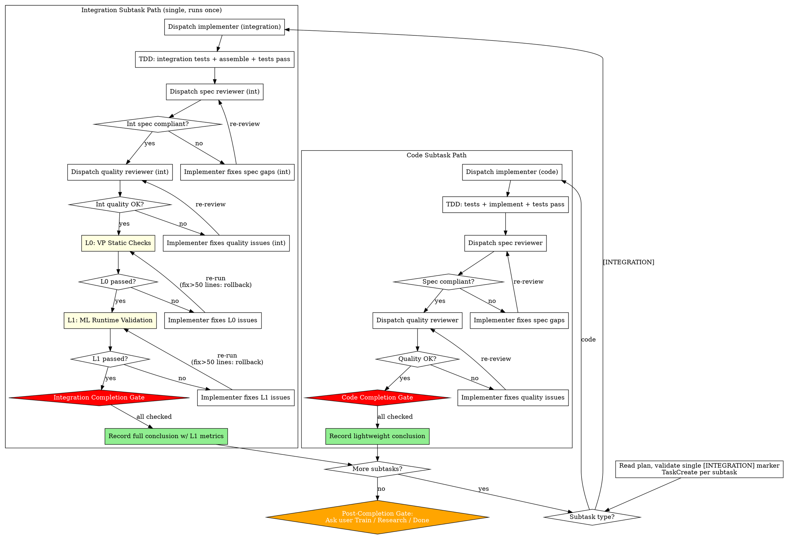

<HARD-GATE>
Subtasks come in TWO types and have DIFFERENT completion gates. The plan MUST mark exactly ONE subtask as `[INTEGRATION]` (the final training pipeline that assembles all components). All others are code subtasks.

A subtask cannot be marked complete unless its type-specific gate passes. No exceptions.

## Code Subtask Completion Gate

For any subtask NOT marked `[INTEGRATION]` (model class, dataset, loss, custom layer, evaluator core, etc.):

- [ ] TDD red → green — unit tests written, failed, then passed
- [ ] Spec Review — passed (experiment design compliance confirmed)
- [ ] Quality Review — passed (code quality confirmed)
- [ ] Lightweight conclusion recorded — "implemented + N unit tests pass"

**Code subtasks do NOT run L0 or L1.** Their correctness is verified by unit tests + reviews. The Validation Pyramid only fires once, on the integration subtask.

## Integration Subtask Completion Gate

For the single `[INTEGRATION]` subtask (the final delivered training pipeline):

- [ ] TDD red → green — integration tests written, failed, then passed
- [ ] Spec Review — passed (experiment design compliance confirmed)
- [ ] Quality Review — passed (code quality confirmed)
- [ ] L0: VP Static Checks — passed (with actual numbers recorded)
- [ ] L1: ML Runtime Validation — passed (with actual metrics and pipeline stages confirmed)
- [ ] Full conclusion recorded — with metric evidence from L1

If ANY item is unchecked, the subtask is NOT complete. Do NOT proceed. Do NOT mark it as done.
</HARD-GATE>

## Anti-Pattern: "Every Subtask Needs Full VP"

Running L0 + L1 on every code subtask was the old design and it was wasteful: L1 takes 5-15 minutes per run, components alone cannot meaningfully validate a training pipeline, and integration bugs only surface at the integration step anyway.

| Thought | Reality |
|---------|---------|
| "I should validate this model class with L1" | Model class alone is not a training pipeline. Unit tests verify deterministic behavior; integration is where training is validated. |
| "Skipping L1 here might miss a shape bug" | TDD unit tests catch shape bugs at the function level. L0+L1 on the integration step catches end-to-end issues, including cross-component shape mismatches. |
| "I should run L0 on every subtask" | L0 checks runtime ML config (device, precision, optimizer, logging). Code subtasks don't have a training run yet — most checks aren't applicable. L0 fires on integration where the full training script exists. |
| "Saving the VP for one step is risky" | The integration step IS the validation step. Catching all integration issues there is the point. |

## Anti-Pattern: "This Integration Subtask Doesn't Need VP"

Equally dangerous in the other direction. Once a subtask is marked `[INTEGRATION]`:

| Thought | Reality |
|---------|---------|
| "This is a small experiment" | Toy experiments with wrong gradients waste days of debugging |
| "Unit tests already passed for the components" | Unit tests check components in isolation. VP checks the assembled training run. They test different things. |
| "L1 is overkill" | If this subtask is the delivered training pipeline, it WILL be trained. VP validates that exact path. |

The integration subtask gets the full L0 + L1 treatment, every time. No exceptions.

# ML Subagent-Driven Development

Execute ML experiment plans by dispatching a fresh subagent per subtask. Code subtasks follow the standard superpowers review path. The integration subtask additionally runs the Validation Pyramid (L0 + L1) once.

**Core principle:** Standard review for components + one full VP at integration = correct implementations with trustworthy training results, without wasting compute on per-component runtime validation.

**Adapted from:** `superpowers:subagent-driven-development`. Key differences:
- Code subtask: standard TDD → Spec Review → Quality Review (matches superpowers, with ML-aware spec criteria)
- Integration subtask: standard reviews + L0 (`spml:ml-static-checks`) + L1 (`spml:ml-runtime-validator`)
- Spec reviewer always checks experiment design compliance (hypothesis, variable control)
- Quality reviewer always checks code quality
- Code subtasks record a lightweight conclusion; integration records full metric evidence
- Shared fix loop: fail → Implementer fixes → re-run failed stage → 5 failures → user intervention
- Large fix rollback: fix > 50 lines → re-run all prior stages

## When to Use

- You have an ML experiment plan (from experiment-planning) with exactly one `[INTEGRATION]` subtask
- Subtasks are mostly independent
- You want to stay in this session (vs. superpowers:executing-plans in parallel session)

## Plan Gate

Before dispatching any implementer subagent, read the plan and fail fast on any of:

- Missing or duplicate `[INTEGRATION]` marker — there must be **exactly one** integration subtask. Send the plan back to `spml:experiment-planning` for revision.
- Plan describes a training task with evaluation but is missing any of:
  - a dedicated evaluation subtask (a code subtask that builds the evaluator core)
  - step-based evaluation cadence
  - evaluation scope, defaulting to `full validation` unless explicitly overridden
  - both required evaluation entry modes (checkpoint-based and in-memory during training)
  - one shared evaluator core across both entry modes
  - evaluation progress visibility requirements
  - mode-aware failure-handling requirements at the evaluation boundary
  - runtime checks (in the integration subtask) for cadence firing and evaluation mode reporting

These are not advisory. Incomplete plans must be sent back for revision before implementation starts.

## Revision Mode Adaptation

When the plan contains revision markers (`[x]`, `REVISED`, `NEW`):

- **`[x]` (unchanged, gate previously passed)** — Skip entirely. Prior results preserved.
- **`[ ] REVISED`** — Re-execute on existing code:
  - Implementer subagent receives the old code file paths as context and modifies in place
  - All gate items for that subtask type must re-run (unit tests + reviews; integration also re-runs L0 + L1)
  - Old gate results are voided
- **`[ ] NEW`** — Normal fresh flow

If a revision touches the integration subtask, L0 + L1 must always re-run. If a revision touches a code subtask that the integration depends on, the integration subtask should be re-flagged for re-execution (its assumptions about that component may have shifted).

## The Process



## Progress Reporting

The orchestrator MUST use TaskCreate/TaskUpdate to give the user real-time visibility into subagent progress.

### Orchestrator Responsibilities

1. **Create one Task per subtask** before dispatching the implementer:
   ```
   TaskCreate(
     subject: "Subtask N: [name][ — INTEGRATION if marked]",
     activeForm: "Implementing [name]",
     description: "Phase: Implementation — starting"
   )
   ```

2. **Update the Task before each phase transition** (use the task ID from step 1):

   | Phase | activeForm | description | Applies to |
   |-------|-----------|-------------|------------|
   | Implementation | `Implementing [name]` | _(subagent updates internally)_ | both |
   | Spec Review | `Spec reviewing [name]` | `Phase: Spec Review` | both |
   | Quality Review | `Quality reviewing [name]` | `Phase: Quality Review` | both |
   | L0 Static | `Running L0 static checks on [name]` | `Phase: L0 VP Static Checks` | integration only |
   | L1 Runtime | `Running L1 runtime validation on [name]` | `Phase: L1 Runtime Validation` | integration only |
   | Fix loop | `Fixing [stage] issues in [name]` | `Phase: Fix loop ([stage], attempt N/5)` | both |
   | Done | _(mark completed)_ | Conclusion summary | both |

3. **Pass `TASK_ID: [id]`** in every subagent prompt so subagents can call TaskUpdate.

### Subagent Responsibilities

Every subagent receives a `TASK_ID` and MUST call TaskUpdate at each milestone to update the task's `description` field. Milestone updates should be concise, one-line status strings.

## ML Implementer Subagent Prompt (code subtask)

```
You are implementing Subtask N: [subtask name]
Type: CODE SUBTASK (no VP — standard review path only)

TASK_ID: [id from orchestrator's TaskCreate]

## Progress Reporting

You MUST call TaskUpdate(taskId=TASK_ID, description="...") at each milestone
below. This is how the user tracks your progress. Do NOT skip this.

## Experiment Context

**Overall hypothesis:** [from plan header]
**This subtask's role:** [what component this builds]

## Task Description

[FULL TEXT of subtask from plan]

## Code Separation Rule

Core code (model, training, data) must NEVER import from test/validation code
or toolkit. Validation scripts observe core code externally.

## Your Job

1. **Write unit tests** for any custom functions (deterministic code only)
   → TaskUpdate: "Phase: Implementation — writing unit tests (N test cases)"
2. **Run unit tests** — verify they fail (TDD red)
   → TaskUpdate: "Phase: Implementation — TDD red confirmed, implementing core code"
3. **Implement core code** (no test/validation imports)
4. **Run unit tests** — verify they pass (TDD green)
   → TaskUpdate: "Phase: Implementation — TDD green, all N tests passing"
5. **Self-review** — check your own code before submission
   → TaskUpdate: "Phase: Implementation — self-review complete, ready for spec review"
6. **Commit** with message: "experiment: [subtask description]"

Note: After your code passes unit tests, the orchestrator will run Spec Review and
Quality Review. You do NOT run reviews yourself. There is NO L0 or L1 for code
subtasks — those run only on the integration subtask.

If this subtask builds an evaluator core:
- build one evaluator core shared by checkpoint-based and in-memory entry modes
- expose mode-aware start/end reporting and boundary errors
- the trainer integration (which decides cadence) happens in the integration subtask

## Report Format

- What you implemented
- Unit test results (N tests, all passing)
- Files changed
- Any concerns or questions
```

## ML Implementer Subagent Prompt (integration subtask)

```
You are implementing Subtask N: [subtask name]
Type: INTEGRATION SUBTASK (this is the final delivered training pipeline)

TASK_ID: [id from orchestrator's TaskCreate]

## Progress Reporting

You MUST call TaskUpdate(taskId=TASK_ID, description="...") at each milestone
below. Do NOT skip this.

## Experiment Context

**Overall hypothesis:** [from plan header]
**This subtask's role:** Assemble all completed components into a runnable
training pipeline. This is THE deliverable — the entry point that gets run
during long-running training and (optionally) inside autoresearch / ml-iteration.
**Validation scope:** L0 + L1 will run on this subtask after standard reviews.

## Task Description

[FULL TEXT of integration subtask from plan]

## Components to Integrate

[list completed code subtasks the integration depends on, with file paths]

## Code Separation Rule

Core code (model, training, data) must NEVER import from test/validation code
or toolkit. Validation scripts observe core code externally.

## Your Job

1. **Write integration tests** — end-to-end smoke test that exercises the
   full pipeline (data → model → loss → backward → step) on a tiny shape
   → TaskUpdate: "Phase: Implementation — writing integration tests"
2. **Run integration tests** — verify they fail (TDD red)
   → TaskUpdate: "Phase: Implementation — TDD red confirmed, assembling pipeline"
3. **Assemble the pipeline** — wire components, write the training script,
   add logging (loss/speed file output, MFU, gradient norms), checkpoint
   save/resume, fixed seeds. Match all production-training requirements
   from the plan.
4. **Run integration tests** — verify they pass (TDD green)
   → TaskUpdate: "Phase: Implementation — TDD green, integration tests passing"
5. **Self-review** — check the assembled pipeline before submission
   → TaskUpdate: "Phase: Implementation — self-review complete, ready for spec review"
6. **Commit** with message: "experiment: [integration description]"

Note: After your code passes integration tests, the orchestrator will run Spec
Review → Quality Review → L0 (ml-static-checks) → L1 (ml-runtime-validator).
You do NOT run reviews or VP yourself.

If evaluation is in scope:
- trainer code decides WHEN evaluation fires (step-based cadence)
- evaluator code decides HOW evaluation runs (shared core across both entry modes)
- emit phase-start / progress / phase-end / result / efficiency signals
- surface mode-aware errors at the evaluation boundary

## Report Format

- What you assembled (file map: which components plug in where)
- Integration test results
- Files changed
- Any concerns or questions
```

## ML Spec Reviewer Prompt

```
You are reviewing whether a subtask implementation matches its experiment design.

TASK_ID: [id from orchestrator]
Subtask type: [CODE | INTEGRATION]

## Progress Reporting

Call TaskUpdate(taskId=TASK_ID, description="...") at start and end:
- Start: "Phase: Spec Review — checking experiment design compliance"
- End:   "Phase: Spec Review — [✅ compliant | ❌ N issues found]"

## Experiment Design

**Hypothesis:** [from plan]
**Independent variable:** [what should change]
**Dependent variable:** [what to measure]
**Control variable:** [what must stay the same]

## Subtask Spec

[FULL TEXT of subtask requirements]

## Your Job

Read the actual code and verify:

**Experiment design compliance:**
- Does the implementation match the stated hypothesis?
- Is ONLY the independent variable changed? (no confounds)
- Are control variables truly unchanged?
- Is the dependent variable being measured correctly?

**Spec compliance:**
- Missing requirements?
- Extra/unneeded work?
- Misunderstandings?

**ML-specific checks:**
- Core code imports from test/validation code? (VIOLATION)
- Validation scripts observe externally? (hooks/wrappers, not modifying core)
- Correct loss function for the task?
- Data preprocessing matches training and evaluation?

**Integration-specific checks (only when subtask type is INTEGRATION):**
- Does the integration assemble exactly the completed components from the plan?
- If evaluation is in scope, does the plan/code preserve the split:
  - trainer decides when evaluation runs
  - evaluator decides how evaluation runs
- If evaluation is in scope, are both entry modes present through one shared evaluator core?
- If evaluation is in scope, is evaluation still observable during long runs?

Report:
- ✅ Spec compliant
- ❌ Issues found: [list with file:line references]
```

## ML Quality Reviewer Prompt

```
You are reviewing implementation quality for a completed ML subtask.

TASK_ID: [id from orchestrator]
Subtask type: [CODE | INTEGRATION]

## Progress Reporting

Call TaskUpdate(taskId=TASK_ID, description="...") at start and end:
- Start: "Phase: Quality Review — checking code quality"
- End:   "Phase: Quality Review — [✅ approved | ❌ N issues found]"

Note: For integration subtasks, L0 (ml-static-checks) and L1 run AFTER this
review. Your job here is purely code quality, not VP.

## Your Job

**Code quality (same as standard review):**
- Clean, maintainable code?
- Proper error handling at system boundaries?
- No security issues?

**ML-specific quality:**
- Fixed random seeds where needed?
- Proper CUDA synchronization for timing?
- No data leakage between train/eval?
- Gradient computation correct (detach where needed)?

**Integration-specific quality (only when subtask type is INTEGRATION):**
- Production-training requirements met (human-readable log file, MFU,
  tqdm/progress, checkpoint interval, resume support, fixed seeds)?
- If evaluation is in scope, are mode-aware boundary errors and progress
  signals implemented where they belong?

Report:
- ✅ Approved
- ❌ Issues: [list with severity and file:line references]
```

## Conclusion Recording

### Code subtask (lightweight)

```markdown
### Subtask N Conclusion (code)

**Role:** [what component this builds]
**Result:** implemented
**Evidence:**
- N unit tests passing
- Files: [list]
```

### Integration subtask (full)

```markdown
### Subtask N Conclusion (INTEGRATION)

**Hypothesis:** [restated]
**Result:** effective / ineffective / inconclusive
**Evidence (from L1):**
- [metric]: [actual value] (expected: [threshold])
- [metric]: [actual value] (expected: [threshold])
**Anomalies:** [any unexpected observations]
**Recommendation:** [proceed / investigate further / abandon direction]
```

Record this in the plan document or a separate experiment log.

## Post-Completion Gate

<HARD-GATE>
After ALL subtasks are complete (code subtasks pass their gate AND the integration subtask passes its gate including L0+L1), you MUST pause and present the following to the user. Do NOT decide this yourself.
</HARD-GATE>

First, check if the brainstorm design doc contains a `## Autoresearch Protocol` section.

**If Autoresearch Protocol section exists**, present to the user:

> All subtasks complete. Integration VP passed. Next step:
>
> 1. **Research** — automated experiment iteration. I will invoke spml:autoresearch-handoff to generate the research protocol and startup prompt for autonomous exploration.
> 2. **Train** — needs long-running training (hours/days). I will invoke spml:training-handoff to generate experiment-context.md + watchdog-prompt.md for a new monitoring session.
> 3. **Done** — experiment is already complete within this session. I will invoke spml:verification.
>
> Which one?

**If no Autoresearch Protocol section**, present the original two options:

> All subtasks complete. Integration VP passed. Next step:
>
> 1. **Train** — needs long-running training (hours/days). I will invoke spml:training-handoff to generate experiment-context.md + watchdog-prompt.md for a new monitoring session.
> 2. **Done** — experiment is already complete within this session. I will invoke spml:verification.
>
> Which one?

- **User chooses Train** → Invoke `spml:training-handoff`. The integration subtask's L1-validated training script is the production training script.
- **User chooses Done** → Invoke `spml:verification` directly.
- **User chooses Research** → Invoke `spml:autoresearch-handoff`. Verification happens later, after autoresearch completes.

When the long-running phase includes evaluation, downstream checks should confirm:
- in-training evaluation fires at the planned step cadence
- checkpoint-based evaluation reports checkpoint load behavior
- in-training evaluation reports that it is using in-memory state
- evaluation start/end messages and progress output appear as runtime checks
- evaluation errors surface with mode-aware context at the evaluation boundary

## Red Flags

**Never:**
- Run L0 or L1 on code subtasks
- Skip L0 or L1 on the integration subtask
- Allow more than one subtask marked `[INTEGRATION]`
- Allow zero subtasks marked `[INTEGRATION]` for an experiment that ends in a training run
- Accept VP "pass" without checking actual numbers
- Let implementer skip unit tests for custom code
- Proceed when an integration VP layer fails (trigger diagnostics instead)
- Change control variables in a subtask (confounds the experiment)
- Record "effective" without L1 evidence

**Always:**
- Validate the `[INTEGRATION]` marker count at Plan Gate
- Record actual metric values (not just pass/fail) for the integration subtask
- Note anomalies even when passing
- Keep core code free of test/validation imports
- Fixed random seeds for reproducibility

## Integration

- **spml:experiment-planning** — Creates the plan this skill executes (must mark exactly one `[INTEGRATION]` subtask)
- **spml:validation-pyramid** — Defines the 2-level VP (runs only on the integration subtask)
- **spml:ml-static-checks** — L0 static analysis (dispatched as subagent on the integration subtask only)
- **spml:ml-runtime-validator** — L1 runtime validation (orchestrator invokes after L0, on the integration subtask only)
- **spml:diagnostics** — Called when integration VP check fails
- **spml:training-handoff** — Called after Post-Completion Gate if user chooses Train
- **spml:verification** — Called after Post-Completion Gate if user chooses Done
- **spml:autoresearch-handoff** — Called after Post-Completion Gate if user chooses Research
- **spml:ml-iteration / spml:autoresearch** — Iterative orchestrators that run their own per-round VP (each round IS an integration delivery); the integration-only rule does not change their per-round behavior
