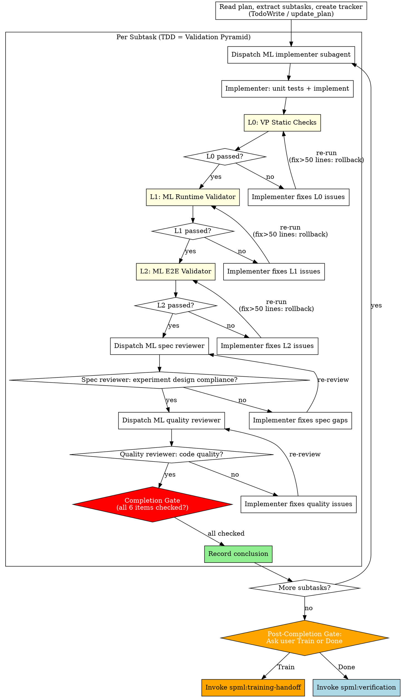

<HARD-GATE>
Every subtask MUST complete ALL of the following before it can be marked complete.
No exceptions. No "this is too simple". No "this is just a toy experiment".

A subtask without VP results and Review results is NOT complete. Period.

## Subtask Completion Gate

Before marking ANY subtask as complete, you MUST have:

- [ ] L0: VP Static Checks — passed (with actual numbers recorded)
- [ ] L1: ML Runtime Validator — passed (with actual metrics recorded)
- [ ] L2: ML E2E Validator — passed (with actual pipeline stages confirmed)
- [ ] Spec Review — passed (experiment design compliance confirmed)
- [ ] Quality Review — passed (code quality confirmed)
- [ ] Conclusion recorded — with metric evidence from VP

If ANY item is unchecked, the subtask is NOT complete.
Do NOT proceed to the next subtask. Do NOT mark it as done.
</HARD-GATE>

## Anti-Pattern: "This Subtask Doesn't Need Full VP"

This is the single most dangerous rationalization in ML experiments.

| Thought | Reality |
|---------|---------|
| "This is just a toy experiment" | Toy experiments with wrong gradients waste days of debugging |
| "The model code is simple" | Simple code with silent shape bugs produces plausible but wrong results |
| "Unit tests already passed" | Unit tests check deterministic logic. VP checks training dynamics. They test different things. |
| "L1/L2 is overkill for this subtask" | If this subtask is part of an ML experiment, it WILL be trained and evaluated. VP validates that. |
| "I'll run VP at the end" | VP per subtask catches bugs early. VP at the end means debugging the entire codebase at once. |
| "The user wants speed" | Skipping VP and debugging silent failures later is SLOWER. |

ML experiments ALWAYS involve a training-evaluation pipeline. Even outputting "loss is decreasing" is evaluation. If there is a pipeline, there is a VP. No exceptions.

# ML Subagent-Driven Development

Execute ML experiment plans by dispatching fresh subagent per subtask, with ML-adapted review criteria: spec compliance (does it match experiment design?), quality review (did Validation Pyramid pass?), and conclusion recording.

**Core principle:** Fresh subagent per subtask + experiment-aware review + conclusion recording = correct implementations with trustworthy conclusions.

**Adapted from:** `superpowers:subagent-driven-development`. Key changes:
- TDD = Validation Pyramid: unit tests → implement → L0 → L1 → L2, THEN Spec Review → Quality Review
- L0: VP Static Checks subagent checks static ML correctness
- L1: Runtime validation (minutes-level training run with metrics collection)
- L2: E2E pipeline validation (1-5 steps per stage)
- Spec reviewer checks experiment design compliance (hypothesis, variable control)
- Quality reviewer checks code quality (VP results already validated by orchestrator)
- Each subtask records: metric data, conclusion, anomaly log
- Shared fix loop: fail → Implementer fixes → re-run level → 5 failures → user intervention
- Large fix rollback: fix > 50 lines → re-run all prior reviews + VP levels

## When to Use

- You have an ML experiment plan (from experiment-planning)
- Subtasks are mostly independent
- You want to stay in this session (vs. executing-plans in parallel session)

## Plan Gate

Before dispatching any implementer subagent, read the plan and fail fast if a training task with validation/evaluation is missing any of the following:

- a dedicated evaluation subtask
- step-based evaluation cadence
- evaluation scope, defaulting to `full validation` unless explicitly overridden
- both required evaluation entry modes:
  - checkpoint-based
  - in-memory during training
- one shared evaluator core across both entry modes
- evaluation progress visibility requirements
- mode-aware failure-handling requirements at the evaluation boundary
- runtime checks for cadence firing and evaluation mode reporting

Do not treat these as advisory. Incomplete plans must be sent back for revision before implementation starts.

## The Process



## ML Implementer Subagent Prompt

```
You are implementing Subtask N: [subtask name]

## Experiment Context

**Overall hypothesis:** [from plan header]
**This subtask's hypothesis:** [specific to this subtask]
**Validation scope:** [which VP levels are enabled]

## Task Description

[FULL TEXT of subtask from plan]

## Code Separation Rule

Core code (model, training, data) must NEVER import from test/validation code
or toolkit. Validation scripts observe core code externally.

## Your Job

1. **Write unit tests** for any custom functions (deterministic code only)
2. **Run unit tests** — verify they fail (TDD red)
3. **Implement core code** (no test/validation imports)
4. **Run unit tests** — verify they pass (TDD green)
5. **Self-review** — check your own code before submission
6. **Commit** with message: "experiment: [subtask description]"

Note: After your code passes unit tests, the orchestrator will run Validation Pyramid (L0/L1/L2) as part of TDD, THEN Spec Review and Quality Review. You do NOT run VP or reviews yourself.

If this subtask includes evaluation work:
- build one evaluator core shared by checkpoint-based and in-memory entry modes
- keep cadence decisions in trainer code and evaluation execution logic in evaluator code
- do not implement final-epoch-only evaluation as the default for long-running training
- expose mode-aware start/end reporting and boundary errors

## Report Format

- What you implemented
- Unit test results
- Files changed
- Any concerns or questions
```

## ML Spec Reviewer Prompt

```
You are reviewing whether a subtask implementation matches its experiment design.

## Context

VP (L0/L1/L2) has already passed before this review. You can reference VP results when checking experiment design compliance — e.g., if L1 showed loss not decreasing, that's relevant to whether the hypothesis implementation is correct.

## Experiment Design

**Hypothesis:** [from plan]
**Independent variable:** [what should change]
**Dependent variable:** [what to measure]
**Control variable:** [what must stay the same]

## Subtask Spec

[FULL TEXT of subtask requirements]

## Your Job

Read the actual code and verify:

**Experiment design compliance:**
- Does the implementation match the stated hypothesis?
- Is ONLY the independent variable changed? (no confounds)
- Are control variables truly unchanged?
- Is the dependent variable being measured correctly?

**Spec compliance (same as standard review):**
- Missing requirements?
- Extra/unneeded work?
- Misunderstandings?

**ML-specific checks:**
- Core code imports from test/validation code? (VIOLATION)
- Validation scripts observe externally? (hooks/wrappers, not modifying core)
- Correct loss function for the task?
- Data preprocessing matches training and evaluation?
- If evaluation is in scope, does the plan/code preserve the split:
  - trainer decides when evaluation runs
  - evaluator decides how evaluation runs
- If evaluation is in scope, are both entry modes present through one shared evaluator core?
- If evaluation is in scope, is evaluation still observable during long runs?

Report:
- ✅ Spec compliant
- ❌ Issues found: [list with file:line references]
```

## ML Quality Reviewer Prompt

```
You are reviewing implementation quality for a completed ML subtask.

Note: VP (L0/L1/L2) and Spec Review have already passed before this review. Your focus is purely code quality. VP metrics are already validated by the orchestrator.

## Your Job

**Code quality (same as standard review):**
- Clean, maintainable code?
- Proper error handling at system boundaries?
- No security issues?

**ML-specific quality:**
- Fixed random seeds where needed?
- Proper CUDA synchronization for timing?
- No data leakage between train/eval?
- Gradient computation correct (detach where needed)?
- If evaluation is in scope, are mode-aware boundary errors and progress signals implemented where they belong?

Report:
- ✅ Approved
- ❌ Issues: [list with severity and file:line references]
```

## Conclusion Recording

After each subtask completes all reviews:

```markdown
### Subtask N Conclusion

**Hypothesis:** [restated]
**Result:** effective / ineffective / inconclusive
**Evidence:**
- [metric]: [actual value] (expected: [threshold])
- [metric]: [actual value] (expected: [threshold])
**Anomalies:** [any unexpected observations]
**Recommendation:** [proceed / investigate further / abandon direction]
```

Record this in the plan document or a separate experiment log.

## Post-Completion Gate

<HARD-GATE>
After ALL subtasks are complete (all Completion Gates passed), you MUST pause and present the following to the user. Do NOT decide this yourself. Do NOT skip this question. Do NOT proceed to verification or training-handoff without asking.
</HARD-GATE>

Present to the user:

> All subtasks complete. VP passed. Next step:
>
> 1. **Train** — needs long-running training (hours/days). I will invoke spml:training-handoff to generate experiment-context.md + watchdog-prompt.md for a new monitoring session.
> 2. **Done** — experiment is already complete within this session. I will invoke spml:verification.
>
> Which one?

- **User chooses Train** → Invoke `spml:training-handoff`. This generates:
  - Production training script with human-readable logging (including MFU, gradient norms, etc.)
  - `experiment-context.md` with VP baseline metrics
  - `watchdog-prompt.md` for monitoring in a separate session
  - Verification happens LATER, after training completes (via `spml:training-resume`)

- **User chooses Done** → Invoke `spml:verification` directly. The experiment is already complete within this session.

When the long-running phase includes evaluation, downstream checks should confirm:
- in-training evaluation fires at the planned step cadence
- checkpoint-based evaluation reports checkpoint load behavior
- in-training evaluation reports that it is using in-memory state
- evaluation start/end messages and progress output appear as runtime checks, not optional niceties
- evaluation errors surface with mode-aware context at the evaluation boundary

## Red Flags

**Never:**
- Skip Validation Pyramid execution
- Accept VP "pass" without checking actual numbers
- Let implementer skip unit tests for custom code
- Proceed when VP layer fails (trigger diagnostics instead)
- Change control variables in a subtask (confounds the experiment)
- Record "effective" without VP evidence

**Always:**
- Record actual metric values (not just pass/fail)
- Note anomalies even when passing
- Keep core code free of test/validation imports
- Fixed random seeds for reproducibility

## Integration

- **spml:experiment-planning** — Creates the plan this skill executes
- **spml:validation-pyramid** — Defines the 3-level VP orchestration
- **spml:ml-static-checks** — L0 static analysis (dispatched as subagent after quality review)
- **spml:ml-runtime-validator** — L1 runtime validation (orchestrator invokes after L0)
- **spml:ml-e2e-validator** — L2 E2E pipeline validation (orchestrator invokes after L1)
- **spml:diagnostics** — Called when VP check fails
- **spml:training-handoff** — Called after all subtasks complete IF long-running training is needed
- **spml:verification** — Called after all subtasks complete IF experiment is already done (no long-running phase)
