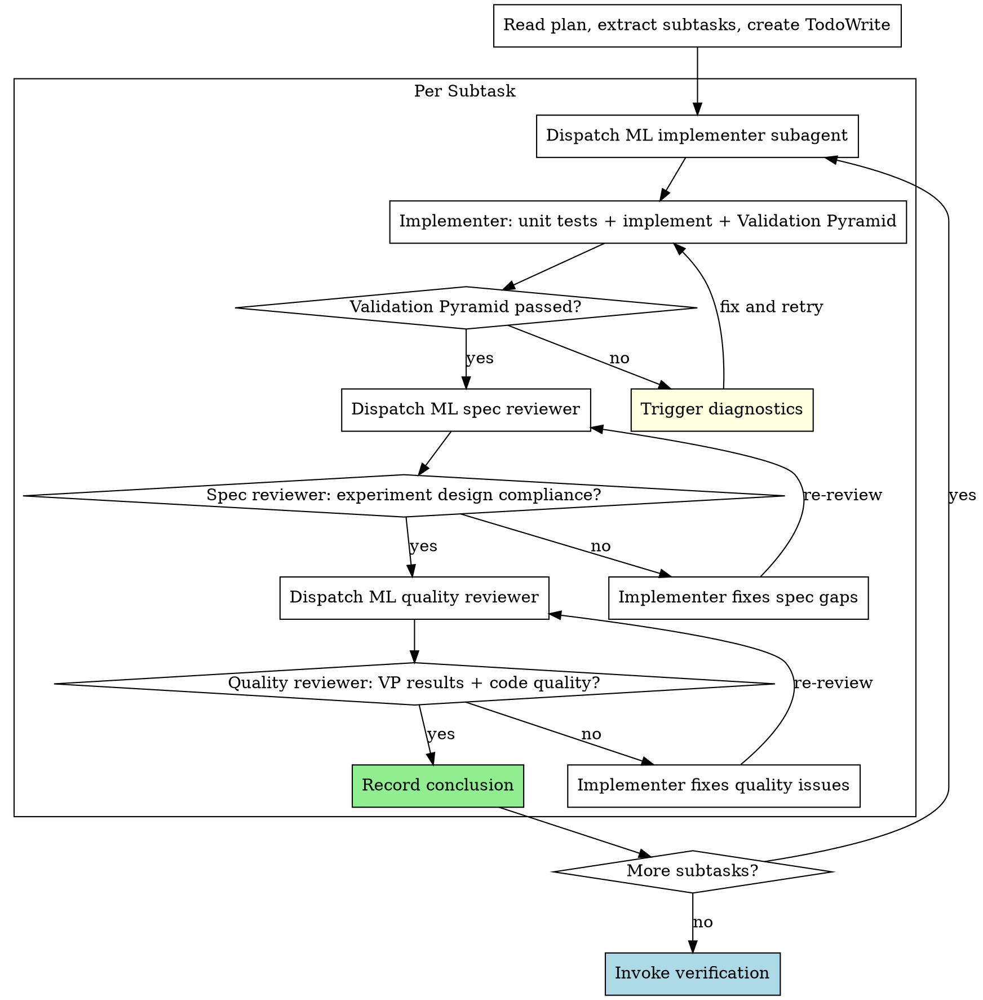

# ML Subagent-Driven Development

Execute ML experiment plans by dispatching fresh subagent per subtask, with ML-adapted review criteria: spec compliance (does it match experiment design?), quality review (did Validation Pyramid pass?), and conclusion recording.

**Core principle:** Fresh subagent per subtask + experiment-aware review + conclusion recording = correct implementations with trustworthy conclusions.

**Adapted from:** subagent-driven-development. Key changes:
- Implementer runs Validation Pyramid after implementation (not just unit tests)
- Spec reviewer checks experiment design compliance (hypothesis, variable control)
- Quality reviewer checks Validation Pyramid results + code quality
- Each subtask records: metric data, conclusion, anomaly log

## When to Use

- You have an ML experiment plan (from experiment-planning)
- Subtasks are mostly independent
- You want to stay in this session (vs. executing-plans in parallel session)

## The Process



## ML Implementer Subagent Prompt

```
You are implementing Subtask N: [subtask name]

## Experiment Context

**Overall hypothesis:** [from plan header]
**This subtask's hypothesis:** [specific to this subtask]
**Validation scope:** [which VP layers are enabled]

## Task Description

[FULL TEXT of subtask from plan]

## Code Separation Rule

Core code (model, training, data) must NEVER import from test/validation code
or toolkit. Validation scripts observe core code externally.

## Your Job

1. **Write unit tests** for any custom functions (deterministic code only)
2. **Run unit tests** — verify they fail (TDD red)
3. **Implement core code** (no test/validation imports)
4. **Run unit tests** — verify they pass (TDD green)
5. **Write validation scripts** (may import from toolkit, use hooks/wrappers)
6. **Run Validation Pyramid** — execute each enabled layer:
   [List exact commands from plan with expected output ranges]
7. **Record results** — actual metrics for each VP layer
8. **Commit** with message: "experiment: [subtask description]"

## Validation Pyramid Execution

For each enabled layer, run the check and report:
- L0: [exact command] — Expected: [thresholds from plan]
- L1: [exact command] — Expected: [thresholds from plan]
- L2: [exact command] — Expected: [thresholds from plan]
- L3: [exact command] — Expected: [thresholds from plan]

If ANY layer fails: STOP. Report which layer failed with actual vs expected.
Do NOT proceed to the next layer.

## Report Format

- What you implemented
- Unit test results
- Validation Pyramid results per layer (actual numbers)
- Files changed
- Any anomalies observed
```

## ML Spec Reviewer Prompt

```
You are reviewing whether a subtask implementation matches its experiment design.

## Experiment Design

**Hypothesis:** [from plan]
**Independent variable:** [what should change]
**Dependent variable:** [what to measure]
**Control variable:** [what must stay the same]

## Subtask Spec

[FULL TEXT of subtask requirements]

## Your Job

Read the actual code and verify:

**Experiment design compliance:**
- Does the implementation match the stated hypothesis?
- Is ONLY the independent variable changed? (no confounds)
- Are control variables truly unchanged?
- Is the dependent variable being measured correctly?

**Spec compliance (same as standard review):**
- Missing requirements?
- Extra/unneeded work?
- Misunderstandings?

**ML-specific checks:**
- Core code imports from test/validation code? (VIOLATION)
- Validation scripts observe externally? (hooks/wrappers, not modifying core)
- Correct loss function for the task?
- Data preprocessing matches training and evaluation?

Report:
- ✅ Spec compliant
- ❌ Issues found: [list with file:line references]
```

## ML Quality Reviewer Prompt

```
You are reviewing implementation quality for a completed ML subtask.

## Validation Pyramid Results

[Paste actual results from implementer report]

## Your Job

**Validation Pyramid review:**
- Did all enabled VP layers actually pass? (check numbers, not just claims)
- Are the metrics within expected ranges from the plan?
- Were any layers skipped that shouldn't have been?
- Any anomalies in the metrics (even if "passing")?

**Code quality (same as standard review):**
- Clean, maintainable code?
- Proper error handling at system boundaries?
- No security issues?

**ML-specific quality:**
- Fixed random seeds where needed?
- Proper CUDA synchronization for timing?
- No data leakage between train/eval?
- Gradient computation correct (detach where needed)?

Report:
- ✅ Approved
- ❌ Issues: [list with severity and file:line references]
```

## Conclusion Recording

After each subtask completes all reviews:

```markdown
### Subtask N Conclusion

**Hypothesis:** [restated]
**Result:** effective / ineffective / inconclusive
**Evidence:**
- [metric]: [actual value] (expected: [threshold])
- [metric]: [actual value] (expected: [threshold])
**Anomalies:** [any unexpected observations]
**Recommendation:** [proceed / investigate further / abandon direction]
```

Record this in the plan document or a separate experiment log.

## Red Flags

**Never:**
- Skip Validation Pyramid execution
- Accept VP "pass" without checking actual numbers
- Let implementer skip unit tests for custom code
- Proceed when VP layer fails (trigger diagnostics instead)
- Change control variables in a subtask (confounds the experiment)
- Record "effective" without VP evidence

**Always:**
- Record actual metric values (not just pass/fail)
- Note anomalies even when passing
- Keep core code free of test/validation imports
- Fixed random seeds for reproducibility

## Integration

- **spml:experiment-planning** — Creates the plan this skill executes
- **spml:validation-pyramid** — Orchestrates VP execution within subtasks
- **spml:diagnostics** — Called when VP check fails
- **spml:verification** — Called after all subtasks complete
