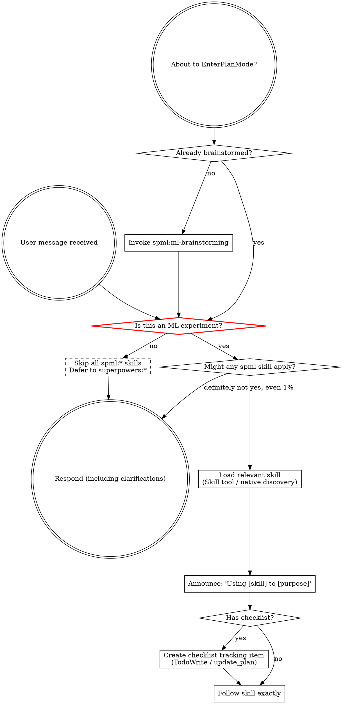

<EXTREMELY-IMPORTANT>
If you think there is even a 1% chance a skill might apply to what you are doing, you ABSOLUTELY MUST invoke the skill.

IF A SKILL APPLIES TO YOUR TASK, YOU DO NOT HAVE A CHOICE. YOU MUST USE IT.

This is not negotiable. This is not optional. You cannot rationalize your way out of this.
</EXTREMELY-IMPORTANT>

## How to Access Skills

Use the mechanism that matches your host:

- In Claude Code: use the `Skill` tool to load skills, `TodoWrite` to track
  checklist items, and `Task` for subagents when a skill asks for them.
- In Codex: rely on native skill discovery from the configured skills
  directory, use `update_plan` to track checklist items, and use native
  subagents.
- In any host: once a skill is loaded, follow it directly and do not treat
  `SKILL.md` like an ordinary project file.

# Using Skills

## ML Experiment Gate (CHECK FIRST)

**Before considering any `spml:*` skill, determine whether the current task is conducting an ML experiment.** SPML skills are designed for running experiments, not for building software — even software that happens to involve ML code.

**IS an ML experiment** (→ proceed with SPML skills):
- Actually training or fine-tuning a model to observe results
- Running hyperparameter sweeps or ablation studies
- Evaluating a trained model's performance on a dataset
- Debugging a live training run (convergence failures, NaN losses, gradient issues)
- Preparing a dataset **for an imminent experiment** (not building a reusable data pipeline)

**Is NOT an ML experiment** (→ skip ALL `spml:*` skills, defer to `superpowers:*` equivalents):
- Building or refactoring ML frameworks, toolkits, or scaffolding
- Implementing model architectures, loss functions, or data loaders as software components
- Writing tests, CI/CD, or infrastructure for ML code
- Developing training pipelines, evaluation harnesses, or experiment tracking systems
- Any task where the goal is shipping code, not observing experimental outcomes

**The key question: Is the goal to observe an experimental outcome, or to ship working software?**
- Observe outcome → SPML
- Ship software → Superpowers (even if the software is ML-related)

## The Rule

**Load relevant or requested skills BEFORE any response or action.** Even a 1%
chance a skill might apply means that you should load it to check using the
host-appropriate mechanism. If a loaded skill turns out to be wrong for the
situation, you don't need to use it.

## Red Flags

These thoughts mean STOP—you're rationalizing:

| Thought | Reality |
|---------|---------|
| "This is just a simple question" | Questions are tasks. Check for skills. |
| "I need more context first" | Skill check comes BEFORE clarifying questions. |
| "Let me explore the codebase first" | Skills tell you HOW to explore. Check first. |
| "I can check git/files quickly" | Files lack conversation context. Check for skills. |
| "Let me gather information first" | Skills tell you HOW to gather information. |
| "This doesn't need a formal skill" | If a skill exists, use it. |
| "I remember this skill" | Skills evolve. Read current version. |
| "This doesn't count as a task" | Action = task. Check for skills. |
| "The skill is overkill" | Simple things become complex. Use it. |
| "I'll just do this one thing first" | Check BEFORE doing anything. |
| "This feels productive" | Undisciplined action wastes time. Skills prevent this. |
| "I know what that means" | Knowing the concept ≠ using the skill. Invoke it. |
| "ML is different, I can skip the process" | ML needs MORE process, not less. Follow it. |

## Skill Priority

When multiple skills could apply, use this order:

1. **Process skills first** (`spml:ml-brainstorming`, `spml:diagnostics`) - these determine HOW to approach the task
2. **Validation skills second** (`spml:validation-pyramid`, `spml:ml-static-checks`, `spml:ml-runtime-validator`, `spml:ml-e2e-validator`) - these verify correctness
3. **Implementation skills third** (`spml:experiment-planning`, `spml:subagent-dev`) - these guide execution

"Let's train X" -> `spml:ml-brainstorming` first, then `spml:experiment-planning`.
"Training isn't converging" -> `spml:diagnostics` first, then validation skills.
"MFU is too low" -> `spml:diagnostics` first, then `spml:ml-runtime-validator`.

## Skill Types

**Rigid** (validation-pyramid, diagnostics): Follow exactly. Don't adapt away discipline.

**Flexible** (framework knowledge): Adapt principles to context.

The skill itself tells you which.

## Core Principle for ML

**In ML, code running without errors does NOT mean it's correct.** "Not working" is reasonable, but the process must be correct. Always validate through the Validation Pyramid before concluding an experiment.

## User Instructions

Instructions say WHAT, not HOW. "Train X" or "Fix convergence" doesn't mean skip workflows.
