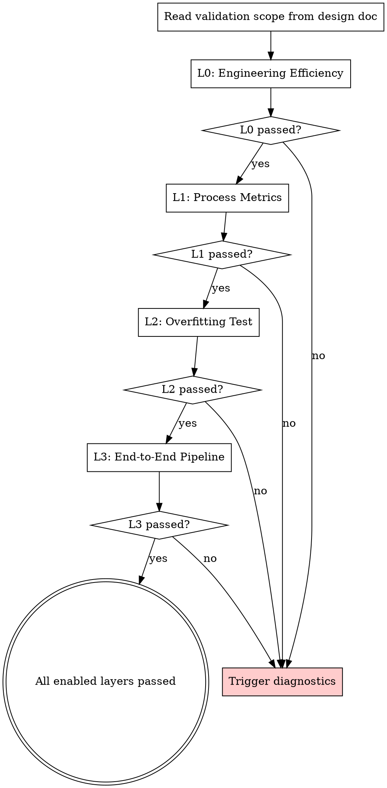

# Validation Pyramid

## Overview

The Validation Pyramid extends TDD to ML workflows. Each layer follows the same RED-GREEN-REFACTOR rhythm: write the validation script first, watch it fail, implement until it passes. Since every layer runs in minutes on small data, TDD's fast feedback loop applies naturally. The Pyramid runs layered checks from cheap/fast (L0) to expensive/slow (L3), catching implementation errors before they waste GPU hours.

**Core principle:** In ML, code running without errors does NOT mean it's correct. The Validation Pyramid ensures the process is correct, so you can trust that "not working" means the strategy is ineffective — not that the implementation is wrong.

**This is a RIGID skill.** Follow exactly. Don't skip layers. Don't adapt away discipline.

## When to Use

- After implementing any ML code (model, training loop, data pipeline, custom layer)
- During each subtask in an experiment plan
- When diagnostics identifies an issue and you need to re-validate after fixing

## Orchestration Logic



**Rules:**
1. Execute layers in order: L0 -> L1 -> L2 -> L3
2. Skip layers marked as "skip" in design doc
3. Each layer must pass before proceeding to next
4. Failure at any layer -> trigger **spml:diagnostics**
5. After diagnostics fix -> re-run from the failed layer, not from L0

## TDD Rhythm: RED → GREEN → REFACTOR

Every Pyramid layer follows TDD's core cycle:

### RED — Write validation script, watch it fail

Write the validation assertion BEFORE writing or optimizing implementation code. Run it. It must fail. Failure proves the validation script has discriminating power.

```python
# Example: L0 MFU check
def test_mfu_meets_target():
    result = calculate_mfu(model, input_shape, step_time)
    assert result['mfu'] >= 0.4, f"MFU {result['mfu']} below target 0.4"
# Run -> FAIL (MFU is 0.15, code not optimized yet)
```

### GREEN — Implement/optimize until validation passes

Write or optimize implementation code. Re-run validation each iteration. Multiple iterations are expected.

### REFACTOR — Clean up, keep validation passing

Clean up implementation code. Validation must stay green.

### Per-layer RED examples

| Layer | RED (write first) | GREEN (make it pass) |
|---|---|---|
| L0 Engineering Efficiency | `assert mfu >= target`, `assert fa_backend_enabled` | Optimize kernel selection, enable FA, adjust batch size |
| L1 Process Metrics | `assert no_gradient_nan()`, `assert attention_entropy > threshold` | Fix initialization, adjust lr, fix attention mask |
| L2 Overfitting Test | `assert loss_monotonically_decreasing(losses)` | Fix model/loss implementation bugs |
| L3 E2E Pipeline | `assert pipeline_completes_without_error()` | Fix data flow, shape mismatches |

### Validation passes immediately?

If the validation script passes on the first run, investigate:
- Is the threshold too lenient?
- Is the implementation already correct?
- Is the validation script actually testing what you intend?

Just like in TDD: a test passing immediately means you may not be testing the right thing. Verify the validation has discriminating power before proceeding.

## How to Use

1. Read the validation scope from the brainstorm design doc
2. For each enabled layer, invoke the corresponding vp-* skill:
   - L0: **spml:vp-engineering-efficiency**
   - L1: **spml:vp-process-metrics**
   - L2: **spml:vp-overfitting-test**
   - L3: **spml:vp-e2e-pipeline**
3. The vp-* skill tells you what to check, what tools to use, how to interpret results
4. Record pass/fail for each layer

## Dynamic Selection Within Layers

Each layer has universal checks and architecture-specific checks. See `decision-tree.md` for which sub-checks to load based on architecture type.

## Hierarchical Decomposition on Failure

When a layer fails:
```
Overall metric not meeting target
    -> Decompose into substructures (defined in brainstorm)
    -> Validate each substructure with mock data
    -> Locate bottleneck substructure
    -> Drill to operator level if needed
```

## Three Granularity Levels

| Granularity | When | Method |
|-------------|------|--------|
| Function/operator | Custom loss, custom layer, single operator | Traditional unit test, deterministic |
| Module/layer | Network substructure efficiency | Mock data, per-segment profiling |
| Experiment | Full L0-L3 pyramid | Training process metrics |

## Quick Reference

See `layer-overview.md` for a compact table of all layers, metrics, and thresholds.

## Red Flags

- Skipping a layer because "it's probably fine"
- Running L2 before L0/L1 pass
- Ignoring a failed layer and proceeding
- Not re-running after a fix
- "I'll validate later" — validate NOW

## Integration

- **spml:brainstorming** — Defines validation scope
- **spml:diagnostics** — Triggered on failure
- **spml:experiment-planning** — Each subtask specifies which layers apply
